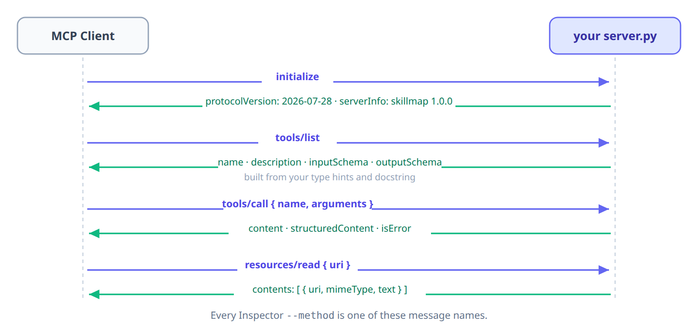
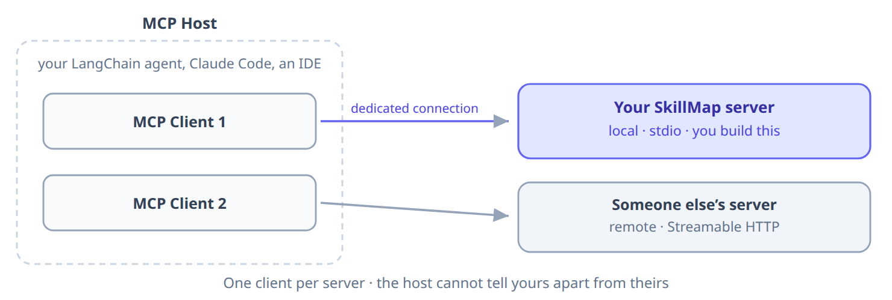
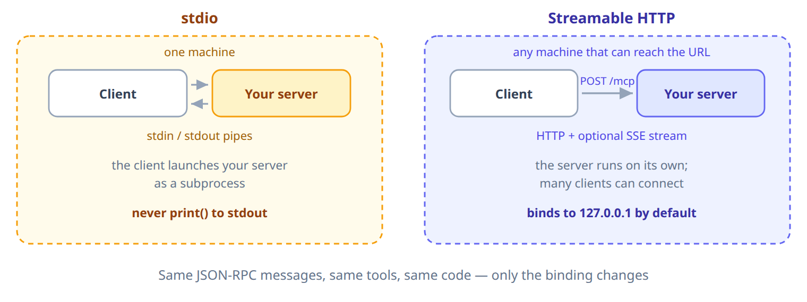
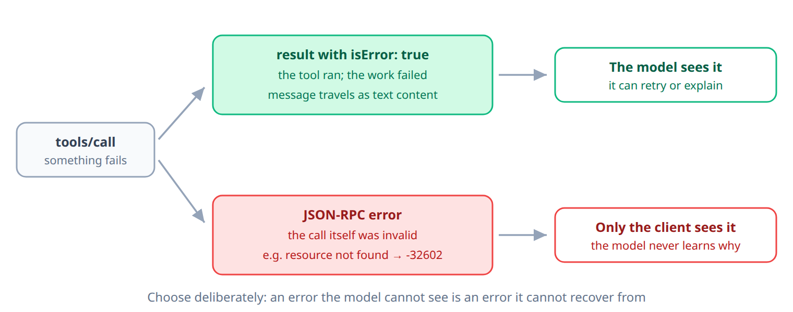

# Build Your Own MCP Server

**Course:** Building LLM Applications  
**Topic:** Model Context Protocol — Authoring Servers  

---

## Introduction

In the **Integrating MCP** session we gave the SkillMap Agent a capability it did not own. We pasted a URL into `MultiServerMCPClient`, called `get_tools()`, and Tavily's search simply arrived:

```python
client = MultiServerMCPClient({
    "mcp_tavily": {"transport": "http", "url": "https://backend.composio.dev/..."}
})
mcp_tools = await client.get_tools()
```

And the agent could use it straight away:

* **User**: "What's the demand for Generative AI in the industry?"
* **Agent**: *Researches current demand, salary ranges and hiring trends, and summarises them.*

We never wrote that search tool. We never saw a line of its code. We pointed at an address, and it worked.

Sitting right beside it in the same agent was `search_jobs` — the JSearch tool we built ourselves, doing an equally useful job. Two tools, side by side, apparently equal.

But there is a question that session never asked:

> **Why can a tool we did not write travel into any agent — while the tool we did write works in exactly one?**

This session answers it. We will build an MCP server of our own, put the SkillMap tools behind it, and connect it back to our agent — after which our tools travel exactly like Tavily's did.

---

## The Problem: Our Tools Do Not Travel

Let's put that question to the test, using two agents we have already built.

**The SkillMap Agent** — the one we have been working on all along:

* **User**: "Find me GenAI jobs in Hyderabad"
* **Agent**: *Lists 5 openings with companies and apply links.*

Perfect. `search_jobs` is doing exactly its job.

**The Interview Assistant** — built in an earlier session. Same learner, same afternoon:

* **User**: "What roles should I prepare for?"
* **Agent**: "I can help you practise, but I cannot look up live openings."

Nothing here is broken. The Interview Assistant is working exactly as designed — it runs mock interviews, and job lookup was never part of it.

But look at what just happened. **The capability exists.** It is forty lines away, in another notebook, and completely out of reach.

### Why This Happens

Compare the two tools that sat side by side in the SkillMap Agent:

| | Tavily's search | Our `search_jobs` |
|---|---|---|
| Where it lives | Behind a server, at an address | Inside one notebook |
| A second agent uses it | Add a URL | Copy the function |
| A teammate uses it | Send a URL | Send the code, and the keys |
| When it changes | The owner redeploys once | Every copy goes stale |

`search_jobs` is not badly written. It is perfectly good code with no way in.

The difference has nothing to do with quality and everything to do with **shape**. Tavily's tool is a *service* — it has an address, and anything that can reach the address can use it. Ours is a *function* — to use it, you must first become the program it lives inside.

> **A capability only one program can reach is not reusable. It is copyable — and those are not the same thing.**

The whole problem is visible in one line from that session:

```python
all_tools = mcp_tools + [search_jobs]
```

That `+` is two different worlds stapled together. On the left, tools that arrived over a protocol. On the right, a tool that had to be pasted in.

That gap is what an MCP server fills, and it is what we build today:

| | What we did | Who could use it |
|---|---|---|
| Building AI Agents with LangChain | Wrote `@tool` functions | That one agent |
| Integrating MCP | Consumed **someone else's** server | That one agent |
| **This session** | **Publish our own server** | **Anything that speaks MCP** |

Same functions. Same API calls. The only thing that changes is who else can reach them — and that turns out to change quite a lot.

---

## How MCP Actually Works

In the **Integrating MCP** session, one line did something remarkable and we let it pass without comment:

```python
mcp_tools = await client.get_tools()
```

A program we did not write, running somewhere we never looked, handed our agent a set of working tools. That was not magic. It was **one message**.

### A Small, Fixed Vocabulary

MCP runs on **JSON-RPC** — an agreed shape for "call this, with these arguments", sent as JSON. What makes it a *protocol* rather than just JSON is that the set of messages is fixed and small. The client asks; the server answers.

Four exchanges carry almost everything:



**1. `initialize` — "which version do we both speak, and who are you?"**

Every connection opens with this. The server we are about to build answers:

```
protocol_version: 2026-07-28
server_info: name='skillmap' version='1.0.0'
```

<MultiLineWarning text="This handshake is on its way out">

That `initialize` exchange is what the SDK you are installing actually does, and it is what you will see in the Inspector. But the **specification has already moved past it.**

The `2026-07-28` revision is **stateless**: *"There is no negotiation handshake. Every request carries its protocol version, and the server accepts or rejects each request independently."* Version and capabilities travel in a `_meta` field on every request, and servers are meant to implement a `server/discover` method instead.

The Python SDK has not caught up. Probe a 2.x server over HTTP and you get:

```
server/discover  ->  Bad Request: Missing session ID
tools/list       ->  Bad Request: Missing session ID
initialize       ->  works
```

Session IDs and a handshake — the spec calls that **legacy** (revision `2025-11-25` and earlier). So learn the four exchanges here, because that is what your server does today. Just know the direction of travel: the handshake is going away, and anything you build that assumes a long-lived session will need revisiting.

</MultiLineWarning>

**2. `tools/list` — "what can you do?"**

The client asks what exists. The server answers with names *and machine-readable schemas*:

```
['skill_demand', 'search_jobs', 'save_learner_profile']
```

```json
{
  "type": "object",
  "properties": {
    "skill":    {"title": "Skill",    "type": "string"},
    "location": {"title": "Location", "type": "string"}
  },
  "required": ["skill", "location"],
  "title": "search_jobsArguments"
}
```

**3. `tools/call` — "run this one, with these arguments"**

```
isError=False  content=[TextContent(type='text', text='Saved profile for Anil.')]
```

**4. `resources/read` — "give me the contents of this URI"**

```json
{"name": "Anil", "skill": "Generative AI", "location": "Hyderabad"}
```

`prompts/get` and `resources/templates/list` follow the same shape: ask, answer.

### Why Discovery Is the Whole Trick

Look again at exchange 2, because it answers the question we opened this session with.

A client can use a server it has never seen — written by someone it will never meet, in a language it does not share, running on a machine it cannot inspect — because it **asks first**, and gets back schemas precise enough to construct a call from.

That is exactly what `get_tools()` did. It sent `tools/list`, read the schemas that came back, and turned each one into a LangChain tool. Tavily's search "just appeared" because it could be *asked about*.

Our `search_jobs` could not travel for one reason: **nothing could ask it that question.** There was no address to send `tools/list` to. That is not a code-quality problem. It is a missing conversation.

> A tool becomes reusable the moment something else can ask it what it does.

### What This Means for the Rest of the Session

Building a server is writing the answers to those four questions. Every decorator ahead maps onto one of them:

| You write | It answers |
|-----------|-----------|
| `@mcp.tool()` | `tools/list` (the schema) and `tools/call` (the work) |
| `@mcp.resource(...)` | `resources/read` |
| `@mcp.prompt()` | `prompts/get` |
| `version="1.0.0"` | part of `initialize` |

The SDK handles the JSON. Our job is deciding what those answers should be.

---

## Which Primitive, and Why

A server can expose three kinds of thing. The **Integrating MCP** session named them — tools, resources, prompts. Here is what it did not say, and it is the thing that decides which one you reach for:

> **They differ by who chooses to use them.**

| Primitive | What it is | Who chooses to use it |
|-----------|-----------|----------------------|
| **Tools** | Functions that *do* something | **The model** — it decides a search is needed |
| **Resources** | Read-only data offered as context | **The application** — the host program (your agent script, Claude Code, an IDE) puts it in front of the model |
| **Prompts** | Templates someone deliberately picks | **The user** — from a menu or a slash-command |

"The application" is the host program the model runs inside — your agent script, Claude Code, an IDE. It opens one client per server it wants to use:



One sentence to carry:

> **A tool is something the model decides to do. A resource is something the application decides to show it.**

Choosing the wrong primitive is the most common design mistake in a first server, and it is far cheaper to fix now than after other people's clients have connected to you.

---

## What We Are Building

A server called **`skillmap`** that exposes one of each:

| | | Why this primitive |
|---|---|---|
| **3 tools** | `skill_demand(skill)` · `search_jobs(skill, location)` · `save_learner_profile(user_id, name, skill, location)` | The model decides when a search or a save is needed |
| **1 resource** | `learner://profile/{user_id}` → the saved profile as JSON | The application supplies it as context; the model never "calls" it |
| **1 prompt** | `career_review(skill, location)` → a ready-made career question | The user picks it to start a workflow |

### How We Get There

Freeing `search_jobs` from that notebook is not one job — it is four questions, and every step below answers one of them:

| The question | Answered by |
|--------------|-------------|
| How does a function in a notebook become a program something else can start? | Steps 1–3 |
| How does it offer *data* and *workflows*, not just actions? | Steps 4–5 |
| Who is allowed to reach it? | Step 7 |
| How do we know it works — and keep it working as it changes? | Steps 8–10 |

Step 6 is a short detour: a look at how a server can ask the *user* a question. We read that one rather than build it.

Step 11 then puts it back where we began: our own agent, consuming our own server.

---

## Heads Up: We Are Leaving Colab

Every session so far has run in Google Colab. This one cannot, and it is worth understanding why rather than just accepting it.

An MCP server using the **stdio** transport is launched *as a subprocess* by whichever program wants to use it — the client literally runs `python server.py` the way you would in a terminal, and then talks to that program through its input and output. So it needs a real command on a real machine. A Colab notebook is not a command another program on your computer can launch.

So for this session we work **locally**: a folder, a `server.py` file, and a terminal.

### What Replaces the Notebook

Three habits change, and none of it is arbitrary — each follows from that one fact that something *else* now starts your code.

| In Colab | Locally | Why it has to change |
|----------|---------|---------------------|
| A cell you run | A `.py` file a command runs | A client cannot "run a cell". It needs a command. |
| `!pip install X` | `uv add X` | The client must be able to start your server in an environment where `X` is already there |
| The runtime resets | A project folder that persists | Your server has to still work tomorrow, when you are not the one starting it |

The middle row is the one that bites people, so it is worth being precise about.

In Colab, `!pip install` puts a package into whatever runtime the notebook happens to be using — and *you* are always the one running the code, in that same runtime, so it works. When a client launches your server there is no notebook and no shell you configured. "Installed" therefore has to mean something stricter: installed into **a specific environment that a specific command can start**.

That environment is a **virtual environment** — a private folder of packages belonging to one project, so your MCP server's dependencies cannot be broken by something you installed for a different project last week.

**`uv`** is what we use to manage it. It is a fast Python project manager that creates the virtual environment, installs into it, and — the part that matters most here — *runs* code inside it with `uv run`. That single guarantee is why the command we hand to every client in this session is `uv run server.py` rather than `python server.py`: it makes the environment your server starts in the same environment you installed into. Get that wrong and you meet the most common MCP failure of all — a server that works perfectly in your terminal and dies instantly when an agent launches it.

We use `uv` rather than `pip` and `venv` separately for one more reason: it is what the official MCP documentation uses, so every server README you meet in the wild will assume it.

### What You Need

| Requirement | Why |
|-------------|-----|
| Python 3.10 or higher | Required by the MCP Python SDK |
| MCP Python SDK 2.0.0 or higher | The API changed significantly in 2.x |
| Node.js 22.19.0 or higher | Only for the MCP Inspector, our testing tool |

---

## Step 1: Project Setup

Right now `search_jobs` is a cell in a notebook. Nothing outside that notebook can start it, so nothing outside that notebook can use it. Before it can be reached by anything, it has to become a **program** — a folder, a file, and a command that runs it.

That is all this step is. If `uv` is not on your machine yet:

```bash
# Install uv (macOS / Linux)
curl -LsSf https://astral.sh/uv/install.sh | sh
```

```powershell
# Install uv (Windows PowerShell)
powershell -ExecutionPolicy ByPass -c "irm https://astral.sh/uv/install.ps1 | iex"
```

```bash
uv init skillmap-mcp
cd skillmap-mcp
uv add "mcp[cli]" requests python-dotenv
```

Then create `server.py` in your editor, and delete the `main.py` that `uv init` generated — we will not use it.

Notice what is *not* here: we never activate the virtual environment. `uv add` creates it, and `uv run` uses it, so activating adds a step that can be forgotten and a command that differs on every platform. Not activating is also closer to the truth of this session — a client launching your server will never activate anything either.

`requests` is the same library our SkillMap tools already used, so the tool bodies we port over in Step 3 need no rewriting at all. `python-dotenv` lets the server read its API keys from a `.env` file.

Which makes this the moment to stop those keys ever reaching a repository:

```bash
printf '.env\n.venv/\nprofiles.json\n__pycache__/\n' > .gitignore
```

Worth being explicit, because this session introduces both files in the same breath: **`.env` is never committed. `.mcp.json` is** — it holds the address of a server, not the credentials to use it.

The `[cli]` extra adds an `mcp` command for running servers locally. We will test with the Node-based MCP Inspector instead, because it also gives us a browser UI and a terminal UI, but the extra is small and worth having.

When you build your **own** server later, add its libraries the same way — `uv add pandas`, `uv add psycopg`, whatever it needs. This matters more than it looks: a client does not run your server the way you do. It launches it as a subprocess, so your server's dependencies have to be installed in the environment that `uv run` starts, not in whatever shell you happened to be in. Most "it works for me but not from the agent" problems are exactly this.

---

## Step 2: The Smallest Server That Runs

It is tempting to paste all three tools in at once. Resist it — a server that fails to start gives you very little to go on, and three tools' worth of code is three times as much to search.

We get **one** tool answering first. After that, adding the others is repetition rather than debugging.

Open `server.py`:

```python
from mcp.server import MCPServer

mcp = MCPServer("skillmap", version="1.0.0")


@mcp.tool()
def skill_demand(skill: str) -> str:
    """Research industry demand, salary insights and career trends for a skill."""
    return f"Demand information for {skill}"


if __name__ == "__main__":
    mcp.run(transport="stdio")
```

That is a complete, working MCP server. Three things are doing the work:

* **`MCPServer("skillmap", version="1.0.0")`** — names the server and declares its version. Clients see both.
* **`@mcp.tool()`** — registers the function as a tool.
* **`mcp.run(transport="stdio")`** — starts it, listening for JSON-RPC messages.

Those twelve lines are already a full participant in the four exchanges we just walked through. It will answer `initialize`, report `skill_demand` when asked `tools/list`, and run it on `tools/call`.

### Check That It Answers

Do not take that on trust — the whole point of starting small is to find out now. Ask your server what it can do:

```bash
npx @modelcontextprotocol/inspector --cli uv run server.py --method tools/list
```

You should see the one tool you just wrote, with the schema the SDK generated for it:

```
skill_demand
```

That is a real `tools/list` exchange against your own server. We will use this command properly in Step 8; right now it is a smoke test, and it is worth running every time you add something.

If it fails instead, run `uv run server.py` on its own first — a server that crashes on startup tells the client nothing, so the error only appears when you run it directly. That single habit will save you more time than anything else in this session.

### Where the Tool Schema Comes From

We never wrote a schema, yet a client already sees this for the one tool now in our file:

```json
{
  "type": "object",
  "properties": {
    "skill": {"title": "Skill", "type": "string"}
  },
  "required": ["skill"],
  "title": "skill_demandArguments"
}
```

The SDK builds it from the **type hints**, and the **docstring** becomes the tool's description. A tool can also carry a human-readable `title`, separate from the machine-facing `name`:

```python
@mcp.tool(title="Skill Demand")
def skill_demand(skill: str) -> str:
```

`name` is what the model calls; `title` is what a person sees in a client's tool list. This is the same lesson as the `@tool` decorator in LangChain — except now the schema is published over a protocol, so programs you have never seen can read it and know how to call your function.

### Write the Docstring for the Model, Not for Yourself

Spend a moment on that docstring. It is not documentation for you — it is the **only** instruction the model gets about when to reach for this tool. Compare:

```python
"""Search jobs."""                                   # what does it need? when?

"""Search for real job openings requiring a specific skill in a
location. Use when the learner asks what roles are available.
Location is a city name."""                          # a model can act on this
```

Three habits:

* Name the tool as a **verb** — `search_jobs`, not `jobs`.
* Say **when** to use it, not only what it does. That is what the model is deciding.
* Name **units and formats** for anything ambiguous — a city, a currency, a date format.

You can also push detail into the schema itself, per argument:

```python
from pydantic import Field

@mcp.tool()
def search_jobs(
    skill: str,
    location: str = Field(description="City name, e.g. Hyderabad"),
) -> list[dict]:
    """Search for real job openings requiring a specific skill in a location."""
```

That description travels in the published `inputSchema`, so every client that discovers your tool sees it:

```json
"location": {
  "description": "City name, e.g. Hyderabad",
  "title": "Location",
  "type": "string"
}
```

Despite the `=`, `Field(...)` is **not** a default value — the argument stays required. It is how Pydantic attaches metadata to a parameter.

A vague docstring is the most common reason a working server behaves badly: the tool runs fine when called, and the model simply never calls it, or calls it with the wrong thing.

<MultiLineWarning text="Use logging, not print()">

Every program has two output channels: **stdout** for its real output, and **stderr** for messages about what it is doing. A stdio server uses stdout for the protocol itself — which is also where `print()` writes.

The [official MCP server guide](https://modelcontextprotocol.io/docs/develop/build-server) puts it bluntly:

> "**For STDIO-based servers:** Never write to stdout. Writing to stdout will corrupt the JSON-RPC messages and break your server. The `print()` function writes to stdout by default, so keep it out of a STDIO server entirely."

Worth knowing what actually happens, though, because the SDK is ahead of its own documentation. On startup, SDK 2.x takes a private copy of stdout for the protocol and redirects your program's stdout to **stderr** — so a stray `print()` no longer breaks the connection. Try it if you like; it works.

Follow the rule anyway. Use `logging`:

```python
import logging
logger = logging.getLogger(__name__)

logger.info("searching jobs")   # stderr - always safe
print("searching jobs")         # works here, thanks to the SDK. Do not rely on it.
```

Four reasons the rule outlives the guard:

* The documentation states it absolutely, and does not mention the guard — so do not assume every client or SDK relies on it.
* Other MCP SDKs, and older Python versions, have no such protection.
* `logging` gives you levels and timestamps that `print` does not.
* The moment you switch to HTTP, your prints go to a terminal nobody is reading.

Keeping your own output on stderr is the habit. The SDK simply stopped punishing you for forgetting.

</MultiLineWarning>

---

## Step 3: The Three Tools

One tool answers, so the hard part is behind us. This step is deliberately repetition — and the thing worth noticing while we repeat it is how little of the original code has to change.

The function bodies are the same code from the SkillMap Agent. Only the decorator and the process boundary are new.

```python
import json
import logging
import os
from pathlib import Path

import requests
from dotenv import load_dotenv
from mcp.server import MCPServer
from mcp.server.mcpserver.exceptions import ResourceNotFoundError, ToolError

logger = logging.getLogger(__name__)

load_dotenv()
TAVILY_API_KEY = os.environ.get("TAVILY_API_KEY")
RAPIDAPI_KEY = os.environ.get("RAPID_API_KEY")

PROFILES = Path(__file__).parent / "profiles.json"

mcp = MCPServer("skillmap", version="1.0.0")
```

Put your `.env` file **next to `server.py`**, holding `TAVILY_API_KEY` and `RAPID_API_KEY`. `load_dotenv()` looks for it relative to the script, so it is still found when a client launches your server from some other directory.

`ToolError` is how a tool reports a failure that the **model** should see — Step 9 explains why that distinction matters. For now, read it as "fail with a message the model can act on".

### Tool 1 — `skill_demand`

```python
@mcp.tool()
def skill_demand(skill: str) -> str:
    """Research industry demand, salary insights and career trends for a skill."""
    logger.info("skill_demand(%s)", skill)
    if not TAVILY_API_KEY:
        raise ToolError("TAVILY_API_KEY is not configured on the server.")

    try:
        r = requests.post(
            "https://api.tavily.com/search",
            json={"api_key": TAVILY_API_KEY,
                  "query": f"{skill} skills demand and salary 2026",
                  "max_results": 3, "search_depth": "basic"},
            timeout=30,
        )
    except requests.RequestException as e:
        logger.exception("Tavily API call failed")
        raise ToolError(f"Could not reach the Tavily API: {type(e).__name__}") from e
    if r.status_code != 200:
        raise ToolError(f"Tavily search failed with status {r.status_code}.")

    results = r.json().get("results", [])
    if not results:
        raise ToolError(f"No demand information found for '{skill}'.")
    return "\n\n".join(f"{x['title']}\n{x['content'][:300]}" for x in results)
```

### Tool 2 — `search_jobs`

```python
@mcp.tool()
def search_jobs(skill: str, location: str) -> list[dict]:
    """Search for real job openings requiring a specific skill in a location."""
    logger.info("search_jobs(%s, %s)", skill, location)
    if not RAPIDAPI_KEY:
        raise ToolError("RAPID_API_KEY is not configured on the server.")

    try:
        r = requests.get(
            "https://jsearch.p.rapidapi.com/search",
            headers={"x-rapidapi-key": RAPIDAPI_KEY,
                     "x-rapidapi-host": "jsearch.p.rapidapi.com"},
            params={"query": f"{skill} in {location}", "page": "1",
                    "num_pages": "1", "country": "in"},
            timeout=30,
        )
    except requests.RequestException as e:
        logger.exception("jobs API call failed")
        raise ToolError(f"Could not reach the jobs API: {type(e).__name__}") from e
    if r.status_code != 200:
        raise ToolError(f"Job search failed with status {r.status_code}.")

    jobs = r.json().get("data", [])
    if not jobs:
        raise ToolError(f"No {skill} jobs found in {location}.")
    return [{"title": j.get("job_title"), "company": j.get("employer_name"),
             "location": j.get("job_city"), "apply_link": j.get("job_apply_link")}
            for j in jobs[:5]]
```

### Tool 3 — `save_learner_profile`

```python
@mcp.tool()
def save_learner_profile(user_id: str, name: str, skill: str, location: str) -> str:
    """Save a learner's career profile so it can be read back in future sessions."""
    logger.info("save_learner_profile(%s)", user_id)
    data = json.loads(PROFILES.read_text()) if PROFILES.exists() else {}
    data[user_id] = {"name": name, "skill": skill, "location": location}
    PROFILES.write_text(json.dumps(data, indent=2))
    return f"Saved profile for {name}."
```

<MultiLineWarning text="Notice who supplies the user_id">

`user_id` is an ordinary tool argument — which means the **model** fills it in. Combined with the resource we build next, any client can write any learner's profile and read any other one back by guessing an id.

That is a real change from the memory session, where `user_id` came from `runtime.context` and the model could never see or set it.

It is acceptable here for one reason only: on **stdio**, your server is a subprocess launched by one user on one machine, so the operating system is the boundary. Put the same server on a public URL and that boundary disappears — which is what the authentication note in the transports step is really about.

The rule: **an MCP tool argument is something the model can choose. Identity is not.** When a server serves more than one person, the user's identity has to arrive from the transport — a verified token — not from the model's arguments.

</MultiLineWarning>

### One More Thing Worth Knowing Before You Connect Someone Else's Server

Identity is one direction of trust. There is a second, and it runs the other way.

A tool's **description is text the model reads and acts on**. Connecting somebody's MCP server means letting them put instructions into your agent's context — which is a meaningfully different decision from installing a library that only your code calls. Tool **output** lands in that context too: `search_jobs` returns strings from a third-party API, and those strings are untrusted input by the time the model sees them.

We are not covering the defences today. But a server author who has never heard that a description *is* an instruction will eventually write one — or trust one — that should not be trusted.

---

## Step 4: The Resource

Our three tools let the agent *act*. But the SkillMap agent also needed something it had to *know* — the learner's profile.

We could expose that as a fourth tool. It would work, and it would be wrong: the model would have to decide to go and ask for facts it should simply have been handed. Background knowledge the application already has is not an action.

The profile is data the application reads, not an action the model takes — so it is a **resource**.

```python
@mcp.resource("learner://profile/{user_id}", mime_type="application/json")
def learner_profile(user_id: str) -> str:
    """The saved career profile for one learner."""
    data = json.loads(PROFILES.read_text()) if PROFILES.exists() else {}
    if user_id not in data:
        raise ResourceNotFoundError(f"No profile saved for '{user_id}'.")
    return json.dumps(data[user_id], indent=2)
```

### Direct Resources vs Resource Templates

| | Direct resource | Resource template |
|---|---|---|
| URI | Fixed — `config://settings` | Parameterised — `learner://profile/{user_id}` |
| Listed by | `resources/list` | `resources/templates/list` |
| Use for | One specific thing | A family of things addressed by parameter |

Ours is a **template**: `{user_id}` is filled in by the client at read time. A client asking for the templates gets back exactly this:

```
[('learner://profile/{user_id}', 'application/json')]
```

Notes on the URI: `learner://` is a **custom scheme**, which the spec explicitly allows. `mime_type` tells the client how to interpret what comes back.

<MultiLineNote>
When a resource does not exist, the spec requires an error — **not** an empty result. An empty `contents` array is ambiguous: it could mean "exists but is empty" or "does not exist". Raising `ResourceNotFoundError` produces the correct error response.
</MultiLineNote>

---

## Step 5: The Prompt

We have built the two primitives the model and the application control. The third belongs to the **user**.

A prompt is a named, parameterised template the user picks deliberately — it shows up in a client as a slash-command or a menu entry, not as something the model decides to invoke.

```python
@mcp.prompt()
def career_review(skill: str, location: str) -> str:
    """Ask for a structured career review for one skill and city."""
    return (f"I am learning {skill} and job-hunting in {location}.\n"
            f"1. Check current demand for {skill}.\n"
            f"2. Find openings in {location}.\n"
            f"3. Tell me the two skills I am most likely missing.")
```

Same pattern as before: the function name becomes the prompt name, the docstring becomes its description, and the parameters become its arguments. A client listing prompts sees:

```
name: career_review
description: Ask for a structured career review for one skill and city.
arguments: [('skill', True), ('location', True)]
```

And filling it in returns a ready-made message:

```
role: user
text: I am learning Generative AI and job-hunting in Hyderabad.
      1. Check current demand for Generative AI.
      2. Find openings in Hyderabad.
      3. Tell me the two skills I am most likely missing.
```

Notice what a prompt is *not*. It runs no code, calls no API and fetches nothing. It is packaged wording — a good question, written once, that a user can fire without retyping. Our prompt happens to describe using the two tools we just built, and the model will decide to call them once the text arrives.

> Tools do work. Resources supply data. **Prompts supply intent.**

<MultiLineNote>
This is why the ownership column mattered. A user who picks `career_review` has chosen *what to ask*; the model still chooses which tools to call to answer it. Neither one is in charge of the other's job.
</MultiLineNote>

---

## Step 6: Asking the User a Question — Elicitation

**Read this one; do not build it.** Everything else in this session goes into `server.py`. This step does not — our `skillmap` server stays at three tools, one resource and one prompt. Elicitation is here because it completes the picture of what a server can do, and because you will meet it in other people's servers.

Every primitive so far flows one way: the client asks, your server answers. **Elicitation** is the exception — it lets your server stop mid-call and ask the *user* for something.

The case for it is obvious once you see it. `search_jobs` needs a location. If the model didn't supply one, your options today are to fail, or to guess. Elicitation gives you a third: ask.

The code below uses three things we have not needed until now. None is difficult, but meeting all three at once is what makes this look harder than it is:

* **A Pydantic model** — a small class describing the *shape of the answer* you want back. `class CityAnswer(BaseModel): city: str` says "the reply has one field, a string called `city`". It is the same idea as the type hints on your tools, which the SDK has been turning into schemas all session; here you write the shape yourself because it describes an answer rather than a call.
* **`Context`** — an object the framework hands your function so it can talk back to the client mid-call. You have met this pattern before: it is exactly `ToolRuntime` from the memory session.
* **`async def` and `await`** — asking a question means waiting for an answer, and waiting is what `await` is for. You used `await` in the previous session for `get_tools()`; this is the same thing on the server side.

```python
from pydantic import BaseModel
from mcp.server.mcpserver import Context


class CityAnswer(BaseModel):
    city: str


@mcp.tool()
async def search_jobs_interactive(skill: str, ctx: Context) -> str:
    """Search for jobs, asking the learner for a city if one is needed."""
    answer = await ctx.elicit("Which city should I search in?", CityAnswer)
    return f"Searching {skill} jobs in {answer.data.city}"
```

Three things to notice, and the first should look familiar:

* **`ctx: Context` is injected by the framework, and the model never sees it.** Check the published schema and the only argument is `skill`. This is the same trick as `ToolRuntime` in the memory session — a parameter your code needs that the model has no business filling in.
* **The tool is `async def`.** `ctx.elicit` is a coroutine; forget the `await` and you get a `RuntimeWarning` and a tool that silently does nothing. This is the one place in this session where async is not optional.
* **A Pydantic model describes the answer**, so the client knows what to render and you get a typed result back rather than a string to parse.

<MultiLineWarning text="Elicitation needs a client that supports it">

Not every client implements elicitation. Your server can ask; a client that does not support asking will not deliver a prompt to anyone.

So treat it as an enhancement, never as your only path. Keep `location` a normal argument that works when supplied, and use elicitation to fill the gap when it is not — rather than building a tool that *only* works if someone answers a question.

Elicitation is new enough that client support is still uneven, so the code above may not complete a round trip in whatever client you happen to be using. That is a property of the ecosystem today, not a mistake in the code — and another reason we are reading this step rather than building it.

</MultiLineWarning>

`Context` is worth knowing for more than this. It is also how a tool logs back to the client (`await ctx.log(...)`) rather than to stderr.

So: nothing to add to `server.py`. Our server still exposes the three tools, one resource and one prompt we set out to build — which is what you will see in the Final Code later.

---

## Step 7: Transports — stdio vs HTTP

The server works. But look at what we have actually achieved so far: `search_jobs` is reusable by anything **on this laptop**, and by nothing beyond it.

Whether that is enough is not a code question. It is a transport question — and it is the difference between a personal tool and a shared one.

A transport is only a **binding**. The JSON-RPC messages, the tools, and your code are identical either way; all that changes is how bytes travel.



| | **stdio** | **Streamable HTTP** |
|---|---|---|
| How it runs | The client launches your server as a subprocess | The server runs independently; clients POST to a URL |
| Who can reach it | Only the local machine | Anything that can reach the URL |
| Typically serves | One client | Many clients |
| Authentication | The OS process boundary | Bearer tokens, OAuth, headers |
| Use it for | Local tools, development, filesystem access | Shared and remote servers |

Switching is one argument:

```python
if __name__ == "__main__":
    mcp.run(transport="streamable-http")   # instead of "stdio"
```

`mcp.run()` accepts `"stdio"`, `"streamable-http"`, or `"sse"` — but only the first two are standard transports in the current specification. `"sse"` is the older HTTP transport, kept in the SDK so servers can still talk to pre-Streamable-HTTP clients. Reach for it only if something you must support requires it.

(Streamable HTTP still *uses* server-sent events for streaming replies. What went away was SSE as a separate transport, not the technology.)

Running with HTTP prints:

```
INFO:     Uvicorn running on http://127.0.0.1:8000 (Press CTRL+C to quit)
```

Two things to notice:

* The endpoint is **`/mcp`**, so the full URL is `http://127.0.0.1:8000/mcp`.
* It binds to **`127.0.0.1`**, not `0.0.0.0`. That is deliberate: a local-only bind means nothing outside your machine can reach it, no matter what else is misconfigured.

That default is doing real work. The moment a server listens on a public address, anyone who can reach the URL can call every tool you registered — there is no login step in what we have built. Before exposing one for real you need two things the SDK will not add for you: **authentication**, so the server knows who is calling, and a check on the request's `Origin` header, so a web page open in someone's browser cannot quietly make their machine call your server on their behalf. Neither is hard; both are out of scope today. Until then, keep it on `127.0.0.1`.

**The same `server.py` serves both.** Nothing in the tools changes.

<MultiLineNote>
One limit worth knowing before you put a server on a URL. Our tools are ordinary `def` functions that wait up to 30 seconds on a network call, and while one is waiting the server is busy. With a single local client that is invisible. With several clients sharing one HTTP server, calls queue up behind each other.

The fix is to declare them `async def` and use an async HTTP client — the same `await` pattern you already saw with `get_tools()`. We are not doing that today, but that is the reason you would.

The transports differ in cost too. A stdio server is **one process per client**, started fresh each time and thrown away — so anything you keep in a module-level variable is gone by the next launch. An HTTP server is **one process serving many clients**, which is where shared state can actually live.
</MultiLineNote>

---

## Step 8: Testing With the MCP Inspector

Back in Step 2 we ran one command against the server to prove it answered. That was a smoke test. Now the server has three tools, a resource and a prompt — and it is worth learning the tool properly, including how to point it at things that go *wrong*.

We could test through an agent instead, but that is a slow loop for something that might be failing for a one-line reason, and when it does fail you will not know whether the fault is in the server, the agent, or the model's choices. We want to talk to the server directly.

The **MCP Inspector** is the official tool for testing servers, and it ships three clients in one binary:

```bash
# Graphical inspector in the browser
npx @modelcontextprotocol/inspector uv run server.py

# Scriptable command line
npx @modelcontextprotocol/inspector --cli uv run server.py --method tools/list

# Terminal UI
npx @modelcontextprotocol/inspector --tui uv run server.py
```

Two things about that `npx` before we go further, because a Node command in a Python session deserves an explanation.

**Why Node at all?** The Inspector is the reference client maintained by the MCP project itself, and it is written in TypeScript — there is no Python equivalent with the same coverage. This is the protocol paying off in a small way: a Node client can test a Python server precisely because neither side knows or cares what the other is written in.

**Why `npx` rather than installing it?** `npx` downloads a package, runs it once, and keeps nothing. That is deliberate here, not laziness — your test client should live *outside* your server's environment. If the Inspector were installed into your project's virtual environment, it would share your server's dependencies, and a broken install could mask the exact failure you are testing for. Keeping the two apart means that when the Inspector says your server is broken, your server really is broken.

Look at the `--method` values: they are the protocol messages from earlier. The Inspector is not a special interface into your server — it is simply a client, sending `tools/list` and `tools/call` by hand instead of on a model's behalf.

Calling a tool from the CLI:

```bash
npx @modelcontextprotocol/inspector --cli uv run server.py \
  --method tools/call --tool-name search_jobs \
  --tool-arg skill="Generative AI" --tool-arg location="Hyderabad"
```

Now the resource. It reads a saved profile — so save one first, or there will be nothing to read:

```bash
npx @modelcontextprotocol/inspector --cli uv run server.py \
  --method tools/call --tool-name save_learner_profile \
  --tool-arg user_id=learner_001 --tool-arg name=Anil \
  --tool-arg skill="Generative AI" --tool-arg location=Hyderabad
```

Then read it back:

```bash
npx @modelcontextprotocol/inspector --cli uv run server.py \
  --method resources/read --uri "learner://profile/learner_001"
```

Which returns:

```json
{
  "contents": [
    {
      "uri": "learner://profile/learner_001",
      "mimeType": "application/json",
      "text": "{\n  \"name\": \"Anil\",\n  \"skill\": \"Generative AI\",\n  \"location\": \"Hyderabad\"\n}"
    }
  ]
}
```

You get an **envelope**, not your dictionary. Three things in it are worth reading closely:

* **`contents` is an array** — one URI is allowed to return several pieces of content.
* **`mimeType`** is the one we declared on the decorator. This is where it surfaces.
* **Your JSON arrived as a string** inside `text`. The protocol carries text; the client parses it. That is exactly what `mime_type` tells the client to do.

This envelope is what "a resource" actually is on the wire — the clearest view of the protocol you will get all session.

<MultiLineNote>
Test a **failing** call as well as a working one. Confirming that a failure comes back as `isError: true` with a readable message — rather than crashing the server — is the part most people skip.
</MultiLineNote>

---

## Step 9: Structured Error Returns

You now have a way to watch your server answer. Point it at things that go *wrong* and the picture gets more interesting — because this is where careless servers become useless servers.

MCP has **two** ways to report a failure, and they reach different audiences.



| | Tool execution error (`isError: true`) | Protocol error (JSON-RPC `error`) |
|---|---|---|
| Means | The tool ran; the work failed | The call itself was invalid |
| Examples | API rate-limited, no results found, bad input data | Resource not found, malformed request |
| Travels as | Content inside a normal result | A JSON-RPC error response |
| **Who sees it** | **The model** | **Only the client** |

The consequence is the whole point:

> An execution error goes back to the model as text, so it can retry, adjust, or explain. A protocol error does not — the model never learns why anything failed.

That is why our tools raise `ToolError` with a *descriptive message*. "No Generative AI jobs found in Atlantis" is something a model can act on. A generic crash is not.

### What This Looks Like in Practice

Comment out `RAPID_API_KEY` in your `.env` and call `search_jobs`:

```
is_error=True
content=[TextContent(type='text',
         text='Error executing tool search_jobs: RAPID_API_KEY is not configured on the server.')]
```

The model receives that sentence and can tell the learner what went wrong.

**Put the key back before moving on** — the next step re-runs a real `search_jobs` call, and a missing key there would hide the failure it is meant to show.

Reading a resource that does not exist takes the **other** path:

```
MCPError: No profile saved for 'nobody'.
```

### The Rule Most Tutorials Skip

Here is the part that decides whether any of this actually works.

**The SDK only forwards your message when you raise `ToolError`.** Every other exception is caught and replaced with the tool's name and nothing else. Let a network timeout escape and the model receives:

```
is_error=True
content=[TextContent(type='text', text='Error executing tool search_jobs')]
```

No reason. No cause. Nothing to retry against and nothing to tell the learner.

Which is why the `try`/`except` around each HTTP call is not defensive padding — it is the difference between a model that can recover and one that is blind:

```python
try:
    r = requests.get(...)
except requests.RequestException as e:
    logger.exception("jobs API call failed")                              # keeps the traceback
    raise ToolError(f"Could not reach the jobs API: {type(e).__name__}") from e
```

Three deliberate details in those four lines:

* **`requests.RequestException`, not `Exception`.** Catch only what the network can throw. A bare `except Exception` would swallow a typo in your own code below and report it to the model as a network fault.
* **`logger.exception(...)`** writes the full traceback to stderr, where you can read it. The model gets a sentence; you keep the stack.
* **`from e`** preserves the original error underneath, so the traceback shows what actually failed rather than only where you re-raised.

```
is_error=True
content=[TextContent(type='text',
         text='Error executing tool search_jobs: Could not reach the jobs API: ConnectError')]
```

Same failure. One line of difference. The model can now say "the jobs service is unreachable" instead of falling silent.

> **An unhandled exception in an MCP tool is a silent error.**

That is the sentence worth carrying out of this step. Every call that can fail — network, parsing, a missing key — either becomes a `ToolError` with a message, or becomes nothing the model can use.

<MultiLineWarning text="What the Python SDK actually does">

The specification says unknown tools and invalid arguments *should* be protocol errors. The Python SDK is more forgiving: by default it converts almost every tool-side failure into an `isError` result instead.

Calling a tool that does not exist:

```
is_error=True
content=[TextContent(type='text', text='Unknown tool: no_such_tool')]
```

Calling `search_jobs` without the required `location`:

```
is_error=True
content=[TextContent(type='text', text='Error executing tool search_jobs:
         1 validation error for search_jobsArguments
         location  Field required ...')]
```

This is deliberate and usually what you want — the model gets told what went wrong and can fix its own call. Just do not be surprised when a "protocol error" from the spec arrives as an `isError` result in Python.

</MultiLineWarning>

### Structured Output — For Free

Because `search_jobs` is annotated `-> list[dict]`, the SDK generates an **output schema** automatically:

```json
{
  "properties": {
    "result": {"items": {"additionalProperties": true, "type": "object"},
               "title": "Result", "type": "array"}
  },
  "required": ["result"],
  "title": "search_jobsOutput",
  "type": "object"
}
```

Results then arrive with a machine-readable `structured_content` alongside the human-readable text — matching the schema above:

```
structured_content: {'result': [
    {'title': 'Principal Engineer - .NET Core and Generative AI',
     'company': 'Wells Fargo India Solutions Pvt Ltd',
     'location': 'Hyderabad',
     'apply_link': 'https://apna.co/job/...'},
    ...
]}
```

A tool returning a plain `str` gets the simple version of the same thing:

```
save_learner_profile -> structured_content: {'result': 'Saved profile for Anil.'}
```

Clients can validate against the schema instead of parsing prose. The return type hint was all it took.

---

## Step 10: Versioning

Everything up to this point assumed we are the only person using this server. That assumption expires in the very next step.

Once a client connects, it **discovers** our tool names and argument names and builds calls out of them. Those names stop being an implementation detail we can rename on a whim — they become a promise. Versioning is how we keep that promise while still being allowed to change things.

Two different versions are in play, and conflating them causes confusion.

### 1. The Protocol Version

Negotiated automatically when a client connects. The client states the version it speaks; the server replies with one it supports; if the client cannot handle the answer, it disconnects.

That is the **legacy** mechanism, and it is what the SDK does today. Under the current spec there is no handshake at all: every request declares its own version, and a server that cannot serve it replies with `UnsupportedProtocolVersionError` (code `-32022`) listing what it does support, so the client retries. Same goal — agreeing what the two of you speak — reached per request instead of once per connection.

Connecting to our server reports:

```
protocol_version: 2026-07-28
```

MCP has evolved through revisions — `2025-06-18` and `2026-07-28` behave differently under the hood. You do not manage this; the SDK negotiates it. Just know that the version you see is *agreed*, not fixed.

### 2. Your Server's Version

This one is yours to manage:

```python
mcp = MCPServer("skillmap", version="1.0.0")
```

Clients see it as `serverInfo`:

```
server_info: name='skillmap' title=None version='1.0.0' ...
```

Version numbers read **major.minor.patch**. Bumping the first number is a promise you are breaking something; bumping the second says you only added.

That matters more than usual here, because clients **discover your tool schemas** — which makes those schemas a public contract:

| Change | Version bump | Why |
|--------|--------------|-----|
| Add a new tool | Minor — `1.1.0` | Existing calls keep working |
| Add an optional argument | Minor — `1.1.0` | Old calls still valid |
| Rename or remove a tool | **Major — `2.0.0`** | Existing clients break |
| Make an argument required | **Major — `2.0.0`** | Existing calls become invalid |

Once someone else connects to your server, changing an argument name is not a refactor — it is a breaking API change.

### See It Break

Worth doing once, because it takes thirty seconds and the lesson sticks.

First, look at the contract as it stands — this is what any client that connects will discover:

```bash
npx @modelcontextprotocol/inspector --cli uv run server.py --method tools/list
```

Now rename `location` to `city` in `search_jobs`:

```python
def search_jobs(skill: str, city: str) -> list[dict]:   # was: location
```

Now re-run the *same* Inspector call you ran in Step 8 — the one that worked:

```bash
npx @modelcontextprotocol/inspector --cli uv run server.py \
  --method tools/call --tool-name search_jobs \
  --tool-arg skill="Generative AI" --tool-arg location="Hyderabad"
```

```
is_error=True
Error executing tool search_jobs: 1 validation error for search_jobsArguments
city
  Field required [type=missing, input_value={'skill': 'Generative AI', 'location': 'Hyderabad'}, ...]
```

Run `tools/list` again and compare. The published schema now says `city` where it said `location` — you did not edit a schema, you edited a parameter, and the contract changed underneath every client that had already read it.

Nothing about your logic changed. You renamed one parameter, and a call built against your old schema now fails.

That is what "your schemas are a public contract" means in practice, and why that rename is a `2.0.0` rather than a tidy-up. Rename it back before continuing.

---

## Step 11: Connecting It to Our Own Agent

Full circle. This is the same client code from the **Integrating MCP** session — pointed at our own server instead of a hosted one.

<MultiLineWarning text="Install the client library somewhere else">

Do **not** run `uv add langchain-mcp-adapters` inside your `skillmap-mcp` project.

That package still requires SDK **1.x** (`mcp<2.0.0`). Adding it here quietly downgrades the
2.x SDK your server is built on:

```
Collecting mcp<2.0.0,>=1.24.0 (from langchain-mcp-adapters)
  Downloading mcp-1.29.1-py3-none-any.whl
```

After that, `from mcp.server import MCPServer` stops importing and your working server breaks
at the last step of the session — with an error that points at the server, not at the install.

Make a **separate** folder and virtual environment for the client. Keep the server project as
it is.

</MultiLineWarning>

```python
from langchain_mcp_adapters.client import MultiServerMCPClient

client = MultiServerMCPClient({
    "skillmap": {
        "transport": "stdio",
        "command": "uv",
        "args": ["--directory", "/abs/path/to/skillmap-mcp", "run", "server.py"],
    }
})

tools = await client.get_tools()
```

Over HTTP it is a URL instead:

```python
client = MultiServerMCPClient({
    "skillmap": {"transport": "http", "url": "http://127.0.0.1:8000/mcp"}
})
```

Either way, `get_tools()` returns our three tools as LangChain tools, ready to pass to `create_agent`.

<MultiLineWarning text="Why --directory, and why it goes before run">

This is the Step 1 promise coming due. `uv run` works out which project — and therefore which virtual environment — to use from **the directory it is run in**, not from the path of the file you hand it.

A client does not run in your server's folder. It runs in its own. So `uv run server.py` looks for a `server.py` that is not there, and `uv run /abs/path/server.py` finds the file but starts it in *the client's* environment — where `mcp` is not installed, or is the wrong major version. Either way the server exits immediately and the client reports nothing but a closed connection.

`--directory` fixes it by telling uv where the project is:

```bash
uv --directory /abs/path/to/skillmap-mcp run server.py
```

Note where it sits: `--directory` is a flag for **uv**, so it comes *before* `run`. Put it after and uv passes it to your script instead, which is the sort of error that produces a confusing message rather than an obvious one.

This is exactly the failure the troubleshooting table calls "works from the Inspector, not from your agent" — and the reason "installed" had to mean *installed in an environment a specific command can start*.

</MultiLineWarning>

### Tools Are Not the Only Thing You Can Reach

The client can read the resource and the prompt we built too — not just the tools:

```python
# the resource, as a langchain Blob
res = await client.get_resources("skillmap", uris=["learner://profile/learner_001"])
print(res[0].data)

# the prompt, as ready-made chat messages
msgs = await client.get_prompt(
    "skillmap", "career_review",
    arguments={"skill": "Generative AI", "location": "Pune"},
)
print(msgs[0].content)
```

All three primitives, reachable from the agent you already know how to build.

### Connecting It to a Coding Agent

A coding agent is a third kind of client, and it needs no new code from us at all. In Claude Code:

```bash
claude mcp add --transport stdio skillmap -- \
  uv --directory /abs/path/to/skillmap-mcp run server.py
claude mcp get skillmap      # confirm it connected
```

The `--` separator matters: everything after it is the command that launches your server, passed through untouched. Without it, your server's own flags would be parsed as Claude Code's.

You also choose who the server is registered for — `local` (just you, this project), `project` (committed in `.mcp.json` and shared with your team), or `user` (all your projects).

### The Payoff

Look closely at what just happened. Your **server** runs on SDK 2.x. The **client** that
consumed it runs on SDK 1.x — a different major version, with a different API, that cannot
even import your server's code.

It worked anyway, because they never share a Python process. The client launches the server,
and from then on the only thing they agree on is the **messages**.

> **The agent cannot tell the difference between our server and a third-party one — and it does not need to know what the server is written in, or which version of anything it uses.** That is exactly what the protocol bought us.

### The Line We Started With

This session opened on a line from the **Integrating MCP** session:

```python
all_tools = mcp_tools + [search_jobs]
```

That `+` was there because our tools came from two different worlds. Now they do not:

```python
tools = await client.get_tools()      # all of them, over the protocol
```

Concretely, here is what changed about `search_jobs` — the code inside it never moved:

| | Before this session | Now |
|---|---|---|
| Where it lives | One notebook cell | A program with an address |
| The Interview Assistant needs it | Copy the function into it | Add one client; the code never moves |
| A teammate needs it | Send the code, the keys, and instructions | Send one line of config |
| Your coding assistant needs it | Not possible | `claude mcp add ...` |
| You fix a bug in it | Every copy is now stale | Fix once; every client gets it |
| It needs a new capability | Update every copy | Add a tool; clients discover it |

None of that came from better code. It came from putting the same code behind a protocol.

---

<details>
<summary><strong>Final Code (server.py)</strong></summary>

```python
"""SkillMap MCP server — 3 tools + 1 resource + 1 prompt."""
import json
import logging
import os
from pathlib import Path

import requests
from dotenv import load_dotenv
from mcp.server import MCPServer
from mcp.server.mcpserver.exceptions import ResourceNotFoundError, ToolError

logger = logging.getLogger(__name__)          # stderr — keep your own output off stdout

load_dotenv()
TAVILY_API_KEY = os.environ.get("TAVILY_API_KEY")
RAPIDAPI_KEY = os.environ.get("RAPID_API_KEY")

PROFILES = Path(__file__).parent / "profiles.json"

mcp = MCPServer("skillmap", version="1.0.0")


def _load() -> dict:
    return json.loads(PROFILES.read_text()) if PROFILES.exists() else {}


@mcp.tool()
def skill_demand(skill: str) -> str:
    """Research industry demand, salary insights and career trends for a skill."""
    logger.info("skill_demand(%s)", skill)
    if not TAVILY_API_KEY:
        raise ToolError("TAVILY_API_KEY is not configured on the server.")
    try:
        r = requests.post(
            "https://api.tavily.com/search",
            json={"api_key": TAVILY_API_KEY,
                  "query": f"{skill} skills demand and salary 2026",
                  "max_results": 3, "search_depth": "basic"},
            timeout=30,
        )
    except requests.RequestException as e:
        logger.exception("Tavily API call failed")
        raise ToolError(f"Could not reach the Tavily API: {type(e).__name__}") from e
    if r.status_code != 200:
        raise ToolError(f"Tavily search failed with status {r.status_code}.")
    results = r.json().get("results", [])
    if not results:
        raise ToolError(f"No demand information found for '{skill}'.")
    return "\n\n".join(f"{x['title']}\n{x['content'][:300]}" for x in results)


@mcp.tool()
def search_jobs(skill: str, location: str) -> list[dict]:
    """Search for real job openings requiring a specific skill in a location."""
    logger.info("search_jobs(%s, %s)", skill, location)
    if not RAPIDAPI_KEY:
        raise ToolError("RAPID_API_KEY is not configured on the server.")
    try:
        r = requests.get(
            "https://jsearch.p.rapidapi.com/search",
            headers={"x-rapidapi-key": RAPIDAPI_KEY,
                     "x-rapidapi-host": "jsearch.p.rapidapi.com"},
            params={"query": f"{skill} in {location}", "page": "1",
                    "num_pages": "1", "country": "in"},
            timeout=30,
        )
    except requests.RequestException as e:
        logger.exception("jobs API call failed")
        raise ToolError(f"Could not reach the jobs API: {type(e).__name__}") from e
    if r.status_code != 200:
        raise ToolError(f"Job search failed with status {r.status_code}.")
    jobs = r.json().get("data", [])
    if not jobs:
        raise ToolError(f"No {skill} jobs found in {location}.")
    return [{"title": j.get("job_title"), "company": j.get("employer_name"),
             "location": j.get("job_city"), "apply_link": j.get("job_apply_link")}
            for j in jobs[:5]]


@mcp.tool()
def save_learner_profile(user_id: str, name: str, skill: str, location: str) -> str:
    """Save a learner's career profile so it can be read back in future sessions."""
    logger.info("save_learner_profile(%s)", user_id)
    data = _load()
    data[user_id] = {"name": name, "skill": skill, "location": location}
    PROFILES.write_text(json.dumps(data, indent=2))
    return f"Saved profile for {name}."


@mcp.resource("learner://profile/{user_id}", mime_type="application/json")
def learner_profile(user_id: str) -> str:
    """The saved career profile for one learner."""
    data = _load()
    if user_id not in data:
        raise ResourceNotFoundError(f"No profile saved for '{user_id}'.")
    return json.dumps(data[user_id], indent=2)


@mcp.prompt()
def career_review(skill: str, location: str) -> str:
    """Ask for a structured career review for one skill and city."""
    return (f"I am learning {skill} and job-hunting in {location}.\n"
            f"1. Check current demand for {skill}.\n"
            f"2. Find openings in {location}.\n"
            f"3. Tell me the two skills I am most likely missing.")


if __name__ == "__main__":
    mcp.run(transport="stdio")
```

</details>

---

## Starting Your Own Server

You will not build SkillMap again. Here is the shape to start from — everything below is the
minimum that already does the right thing:

```python
from mcp.server import MCPServer
from mcp.server.mcpserver.exceptions import ToolError

mcp = MCPServer("your-server-name", version="0.1.0")


@mcp.tool()
def your_tool(argument: str) -> str:
    """Say what this does AND when the model should use it."""
    try:
        result = do_the_work(argument)
    except Exception as e:                     # narrow this once you know what can fail
        logger.exception("your_tool failed")
        raise ToolError(f"Could not complete the request: {type(e).__name__}") from e
    return result


if __name__ == "__main__":
    mcp.run(transport="stdio")
```

Four things are deliberate in those fifteen lines:

* **The version starts at `0.1.0`.** Below `1.0.0` you are telling clients the schema is not stable yet — which is honest, and buys you room to rename things.
* **The `try`/`except` is already there.** Not as polish, but because an unconverted exception reaches the model as nothing useful (Step 9). Start with it and you never have to remember it — then narrow `Exception` to whatever your work actually raises, as we did with `requests.RequestException`.
* **The docstring says *when*, not just what.** That is the only guidance the model gets.
* **`transport="stdio"`** so a client can launch it immediately. Switch to `"streamable-http"` the day something remote needs it.

Then work outward in the order this session used: get `tools/list` answering, add one real tool, test the failing path, then a resource or prompt if you need one.

---

## What We Are Not Covering

MCP is bigger than one session. Here is what we skipped, so you can tell the difference between "not needed yet" and "nobody mentioned it" when you read the spec later.

**You will meet these when your server gets real:**

| Feature | What it is | When you'll want it |
|---------|-----------|--------------------|
| **Pagination** | List results return a cursor; the client asks for the next page | Your server exposes hundreds of resources |
| **Cache hints** | `MCPServer(cache_hints=...)` tells clients how long a list stays fresh | Clients re-listing your tools on every turn |
| **Subscriptions** | `MCPServer(subscriptions=...)` — push a notification when a resource changes | Data that changes while a client is connected |
| **OAuth** | Your server as an OAuth resource server | Only if you go remote — and this is the hardest part of MCP |

**Extensions — outside the core spec, opt in when needed:**

* **Tasks** (`io.modelcontextprotocol/tasks`) — work too long-running for a single request/response
* **MCP Apps** (`io.modelcontextprotocol/ui`) — interactive UI rendered by the client

Both are declared through the `extensions` field in capabilities. `MCPServer` takes an `extensions=` argument for them.

**Deprecated — do not learn these from an old tutorial:**

* **Sampling** and **roots** — the server asking the client to run an LLM, and asking for filesystem scope. Call an LLM API directly instead.
* **Protocol-level logging** — use Python's `logging` to stderr, as we did in Step 2.
* **HTTP+SSE as a transport** — replaced by Streamable HTTP, as covered in Step 7.

<MultiLineNote>
A pattern worth taking away from this list: **the two divergences we hit are not accidents.** The `print()` rule and the `initialize` handshake both show the same thing — MCP is moving faster than the tools and docs around it.

So when something does not match, check in this order: **the spec**, then **the SDK you have installed**, then the tutorial. In this session the spec was ahead of the SDK twice, and a blog post would have been wrong about both. Pin your SDK version so *you* choose when to move.
</MultiLineNote>

---

## When Things Go Wrong

MCP failures are quieter than the failures you are used to. A server that dies on startup produces **no output at all** through the client — you get a closed connection and nothing else. Learning to look in the right place first is most of the skill.

| Symptom | Where to look first |
|---------|--------------------|
| Client reports the connection closed immediately | Run `python server.py` directly and read stderr — the client hides startup errors |
| A tool you wrote is not in `tools/list` | Two functions registered under the same name; the first one wins |
| `Error executing tool X` with no reason | An exception escaped that was not a `ToolError` (Step 9) |
| Tool works from the Inspector, not from your agent | The client launches your server with a different working directory and `PATH` than your shell |
| Resource read returns an error you did not write | Your URI does not match the template — compare against `resources/templates/list` |

The habit worth building: **run `--method tools/list` before debugging anything else.** If the schema is not what you expect, no amount of staring at the function body will help.

### Debugging Exercise

Three faults. Plant them one at a time in a copy of `server.py`, and before you look at the answer, decide *what you would run first*. None of them raises a useful error on its own.

1. Add `import nonexistent_module` at the top of the file.
2. Register a second tool with a name you already used — a duplicate `search_jobs`.
3. Change `search_jobs`'s return statement to `return {"a", "b"}` (a set, where the annotation says `list[dict]`).

<details>
<summary><strong>Answers</strong></summary>

**1 — Run the server directly.** Through the Inspector you only get:

```
{"error":{"code":"error","message":"Connection closed"}}
```

Nothing about the cause. `python server.py` prints the real `ModuleNotFoundError` immediately. *Lesson: a client cannot show you an error that happened before the server started talking.*

**2 — Check `tools/list`.** The first definition silently wins; the second is discarded, with no warning at all. Your new code is simply never called, and nothing anywhere says so. *Lesson: registration is by name, and the list is the source of truth.*

**3 — This is Step 9 again, from the other side.** A set is not a `list[dict]`, so output validation fails — and because that failure is not a `ToolError`, the model receives:

```
is_error=True
text='Error executing tool search_jobs'
```

*Lesson: the masking rule applies to your own bugs too, not just to failing APIs. A detail-free error usually means an exception you did not convert.*

</details>

---

## When Should You Build an MCP Server?

We now have four ways to give an agent a capability. Choosing well matters more than knowing the syntax.

| Option | Reach for it when | What it costs |
|--------|-------------------|---------------|
| **Built-in tool** | Someone already solved it — Tavily search, a maintained integration | Least control over behaviour |
| **Custom `@tool`** | The logic belongs to *this one agent* and lives in the same codebase | Not reusable outside that codebase |
| **Reusable skill** | You need to teach an agent a *procedure* — no new capability, just instructions it should follow | Only helps agents that read skills |
| **MCP server** | The capability must be reused **across** agents, apps or teams — or must run somewhere else | A process to run, a schema to keep stable, versions to manage |

A short decision path:

1. **Does it already exist?** → Use the built-in tool. Do not rebuild Tavily.
2. **Is it private logic for one agent?** → A custom `@tool`. A function in your codebase is simpler than a server.
3. **Is it instructions rather than a new capability?** → A skill. If the agent could already do it with better guidance, you do not need code.
4. **Do two or more different clients need it?** → An MCP server.

<MultiLineWarning text="Do not reach for a server too early">

An MCP server is not just a function — it is a **deployable artifact with a public contract**. It has to run somewhere, stay up, be versioned, and keep its schemas stable for every client that has discovered them.

That price is well worth paying when several things genuinely need the same capability. It is a poor trade for a function only your own agent will ever call.

Build the `@tool` first. Promote it to a server when something else actually needs to connect.

</MultiLineWarning>

---

## Check Your Understanding

1. You want the **model** to decide when to fetch something. Tool, resource, or prompt? What if the **application** should decide? What if the **user** should?
2. Your server needs to read files from the user's laptop. Which transport — and why is the other one wrong?
3. A tool hits a network timeout and you let the exception propagate. What exactly does the model receive?
4. You add a new optional argument to an existing tool. Minor or major version bump? Now you make that argument required — what changes, and why?
5. Your stdio server starts and exits immediately with no error message. Name two things you would check first.
6. You want a "review my CV" workflow that a user picks from a menu, which then calls two of your tools. Which primitive is the menu entry, and which are the two things it triggers?
7. Your server works from the Inspector but your agent reports a closed connection. Name the two environment differences most likely responsible.

<details>
<summary><strong>Answers</strong></summary>

1. **Tool** for the model, **resource** for the application, **prompt** for the user. That ownership column is the whole distinction.
2. **stdio** — the client launches the server as a subprocess on that machine, so it runs with that user's file access. Over HTTP the server could be anywhere, and "the user's laptop" is not a place it can reach.
3. `is_error=True` and the text `Error executing tool <name>` — the name and nothing else. No cause, nothing to retry against. Convert it to a `ToolError` and the model gets the reason.
4. Optional argument → **minor** (`1.1.0`), because every existing call is still valid. Making it required → **major** (`2.0.0`), because calls that used to work now fail validation. Nothing about your code got more complex; the *contract* got stricter.
5. Run `python server.py` directly to see the startup traceback the client swallowed; and check that the environment the client launches (its working directory and `PATH`) has your dependencies — the Inspector working while your agent fails is almost always this.
6. The menu entry is a **prompt** — the user chose it. The two things it triggers are **tools** — the model decides to call them once the prompt's text arrives. A prompt never calls a tool itself; it only supplies the wording that makes the model want to.
7. The **working directory** (so a relative path like `server.py` or `profiles.json` resolves somewhere else) and the **environment/`PATH`** the client launches with (so your dependencies may not be installed where it looks). Both are why `uv run` is in the launch command.

</details>

---

## Summary

| Concept | What it does | The API |
|---------|--------------|---------|
| Server | The program exposing capabilities | `MCPServer("skillmap", version="1.0.0")` |
| Tool | An action the **model** chooses to take | `@mcp.tool()` |
| Resource | Context the **application** supplies | `@mcp.resource("learner://profile/{user_id}")` |
| Prompt | A template the **user** picks | `@mcp.prompt()` |
| Input schema | Generated from your type hints and docstring | automatic |
| Output schema | Generated from your return type hint | automatic |
| stdio transport | Client launches your server as a subprocess | `mcp.run(transport="stdio")` |
| HTTP transport | Server runs on its own at a URL | `mcp.run(transport="streamable-http")` |
| Execution error | Failure the **model** can see and react to | `raise ToolError("...")` |
| Missing resource | Protocol-level error, not an empty result | `raise ResourceNotFoundError("...")` |
| Testing | Exercise tools and resources directly | `npx @modelcontextprotocol/inspector` |
| Versioning | Your schemas are a public contract | `version=` + semver |

<MultiLineNote>
Most MCP tutorials online still use the older `FastMCP` class (`from mcp.server.fastmcp import FastMCP`). That was the 1.x API. The SDK 2.x code in this session uses `MCPServer`, which is what a fresh `uv add "mcp[cli]"` installs today. If you follow an older tutorial and the imports do not match, this is why.
</MultiLineNote>

The line worth carrying forward:

> A custom tool gives **your** agent a capability. An MCP server gives **every** agent that capability.
