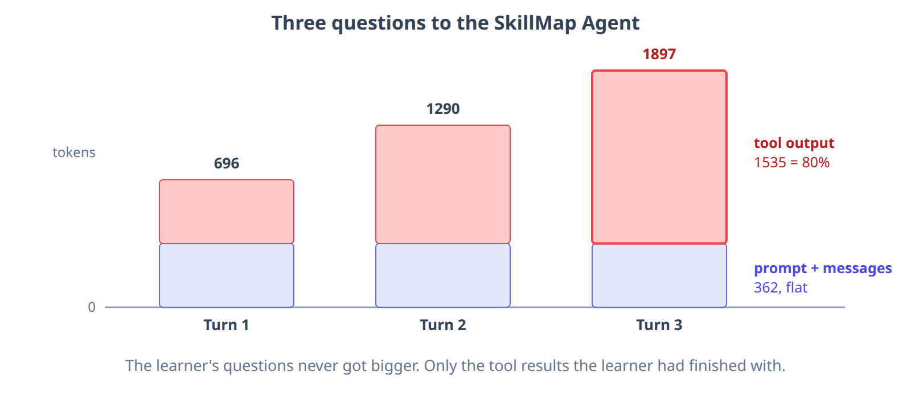
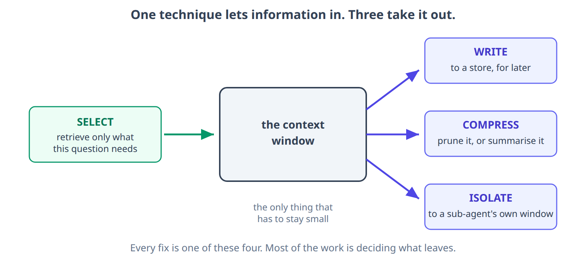
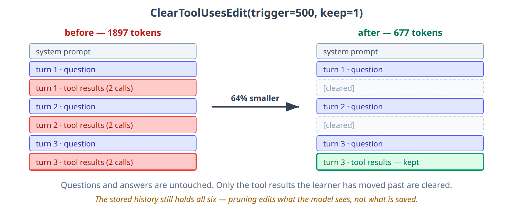

# Context Engineering in Practice

**Course:** Building LLM Applications  
**Topic:** Introduction to Context Engineering and MCP  

---

**Key Takeaways:**

- **The Problem: The Agent Gets Worse the Longer We Talk to It**
- **Why This Happens**
- **What Context Engineering Is**
- **The Context Stack**
- **Context Engineering vs Prompt Engineering**
- **How Context Fails**
- **The Four Techniques**
- **Hands-On: Pruning and Compaction on the SkillMap Agent**
    - **Step 0: Set Up**
    - **Step 1: Where We Left Off**
    - **Step 2: Measure the Context**
    - **Step 3: Add Tool-Output Pruning**
    - **Step 4: Check What Pruning Broke**
    - **Step 5: Add Compaction**
    - **Step 6: Wire Both Into the Agent**
    - **Step 7: The Proof — Ask Turn 4 Again**
    - **Try It Yourself**
- **Overflow Strategies in Depth**
- **Isolating Work with Sub-Agents**
- **Choosing the Right Approach**

---

# Introduction

In the previous units we built the **SkillMap Agent** with LangChain and Google Gemini. We gave
it tools for researching skill demand and finding jobs, then added memory so it recognises a
learner across sessions. Every one of those additions put more information in front of the model.

Now in this unit, we will look at what that information costs. We will watch a working agent get
worse as its context fills. We will name the four ways context fails, and the four techniques for
managing it: write, select, compress and isolate. Then we will apply two of them to the SkillMap
Agent.

---

# The Problem: The Agent Gets Worse the Longer We Talk to It

Three questions to the SkillMap Agent, one after another:

* **Turn 1** — "Find me Generative AI jobs in Hyderabad" → 5 openings.
* **Turn 2** — "Now AI Engineer roles in Bangalore" → 5 more.
* **Turn 3** — "And Machine Learning in Pune" → 5 more.

Every answer is correct. But every tool result from every earlier turn is still in the
conversation. All of it is re-sent to the model on each new turn.



By turn 3, four fifths of what the model reads is search results the learner has already moved
past.

Now ask a fourth question — one that depends on remembering turn 3:

> **Turn 4** — "Of the Pune roles you just listed, which need less than 2 years experience?"

This is the question the rest of the session is about. Everything the agent needs is already in
its window, so it should be easy. Instead the agent starts to slip: it re-runs a search it
already ran, or answers about Bangalore, or drops the formatting rule from its system prompt.

> The agent did not get worse at its job. Its context got noisier.

Hold on to that fourth question. **Step 7** asks it again, after we have fixed the window.

---

# Why This Happens

That growth costs us three things at once, and the slip we just saw is only the first.

| Cost | Why | What it looks like |
|------|-----|--------------------|
| **Accuracy falls** | Attention is finite and spread across whatever we hand the model. One page and it reads every line; fifty pages and everything is skimmed. This decline as the window fills is called **context rot** | A preference stated on turn 2 carries less weight by turn 8 |
| **Cost rises every turn** | The whole context is re-sent on every call, so we pay for turn 1 again on turn 3 | The bill grows even when the questions do not |
| **Latency rises** | More input to read before the first word comes back | Every turn is slower than the last |

None of this announces itself. There is no error. The agent keeps answering, just less well, and
it gets slower and dearer while doing so.

<MultiLineNote>

**More context does not mean better performance.** There is no single safe token limit — the
drop-off depends on the model and the task. A focused 300-token context can outperform an
unfocused 100,000-token one.

<a href="https://research.trychroma.com/context-rot" target="_blank">https://research.trychroma.com/context-rot</a>

</MultiLineNote>

---

# What Context Engineering Is

Managing that growth deliberately, rather than letting it accumulate, is what the discipline is.

* **Context** — everything the model sees on one call: system prompt, tool definitions, the
  conversation so far, retrieved documents, and the current question.
* **Context engineering** — filling that window with **just the right information, in the right
  format, at the right time** to accomplish the task.

The term is new; the idea is not. It is the same problem an operating system solves:

| Computer | AI agent |
|----------|----------|
| CPU | The LLM |
| RAM — limited | The context window — limited |
| The OS, deciding what is loaded into RAM | **Context engineering** |

An LLM with the wrong things loaded behaves like a machine short on RAM. It still runs. It just
does far less useful work.

> The goal is the **smallest set of high-signal tokens that still gets the job done**. Not the
> most context. Not the least. The most useful context per token spent.

<MultiLineNote>

Context engineering is not a new tool to install. It is a set of decisions about information. We
make them with things we already have: a system prompt, a tool, a store, or a piece of
**middleware**. Middleware is code that sits between the agent and the model. The Hands-On
section uses it.

</MultiLineNote>

---

# The Context Stack

If context is everything the model sees, it is worth knowing what "everything" is made of. The
window is a stack of parts competing for one space.


Two things follow:

* **Only some layers grow.** The system prompt is the same size on turn 30 as on turn 1. Tool
  descriptions are fixed, but sent every turn whether used or not — twenty tools is a standing
  tax. Conversation history, and inside it tool output, is what runs away.
* **The layers are not equally valuable per token.** The system prompt is small and shapes every
  answer. A stale search result is large and shapes nothing. That ratio decides what to cut.

---

# Context Engineering vs Prompt Engineering

The system prompt is one band in that stack — which places prompt engineering inside context
engineering, not against it. The difference is scope and timing.

| | Prompt Engineering | Context Engineering |
|---|---|---|
| What it shapes | The wording of an instruction | Everything in the window |
| When it happens | Once, when we write the prompt | Repeatedly, on every model call |
| What changes it | A human editing text | The system, at runtime |
| Typical question | "How do I phrase this?" | "What does the model need right now?" |
| Fails when | The instruction is unclear | The window is full of the wrong things |

A one-shot call — summarise this paragraph, classify this review — is a prompt engineering
problem. An agent is different: it runs many model calls, each carrying whatever the previous
ones left behind. Nobody writes that input by hand, so if we do not decide what it holds, it
simply accumulates.

| Reach for prompt engineering | Reach for context engineering |
|---|---|
| Simple chatbot conversations | Building agents or applications |
| One-shot Q&A | Tasks needing memory across conversations |
| Summarisation or translation | Systems calling tools or databases |
| Quick factual queries | Complex, multi-step workflows and production apps |

> Prompt engineering asks what we say to the model. Context engineering asks what the model is
> looking at when we say it.

---

# How Context Fails


All four get more likely as the window fills. None of them raises an exception, so all four are
found by reading transcripts, not logs.

| Failure | Root cause | How to fix it |
|---------|-----------|---------------|
| **Poisoning** | A wrong fact persists and compounds | Check accuracy before saving · let only trusted sources write to memory · hold unconfirmed facts separately |
| **Distraction** | Too much history crowds out fresh reasoning | **Compress** — prune old tool results, summarise old turns, delete what is finished |
| **Confusion** | Irrelevant content or too many overlapping tools | **Select** — retrieve only what fits the question · write clear, non-overlapping tool descriptions |
| **Clash** | Two contradictory statements, both current-looking | **Write** — one value under one key, newer replaces older · set a priority order for sources |

**Confusion is usually designed in, not accumulated.** Three tools that can all search documents
leave the model guessing which to call. Give each tool one clear purpose, a descriptive name and
no overlap, and the failure never happens:

| Confusing | Clear |
|---|---|
| `search_documents` — searches everything | `search_document_by_keyword` — full-text search |
| `find_files` — also searches documents | `get_document_by_id` — fetch one known document |
| `query_database` — can also search documents | `list_recent_documents` — browse recent items |

---

# The Four Techniques



| Technique | What it does | Where we meet it |
|-----------|--------------|------------------|
| **Write** | Save information outside the window, to read back later | The memory session — `save_learner_profile` writing to `InMemoryStore` |
| **Select** | Pull in only what this question needs | The RAG session — retrieve matching chunks, then answer |
| **Compress** | Shrink what is already in the window | This session — pruning and compaction |
| **Isolate** | Split work so no single window holds it all | Sub-agents, at the end of this doc |

**Compress has two forms**, and the difference decides which to reach for:

| | Pruning | Compaction |
|---|---|---|
| What it does | Removes content outright | Replaces content with a summary |
| Keeps meaning? | No | Yes |
| Costs a model call? | No | Yes |
| Best for | Stale tool output | Long conversations that still matter |

<MultiLineNote>

**Write** is also what settles a context clash. If "internships only" and "full-time roles" are
both in the history, the model has two equally current statements and no rule for choosing. Write
each preference to the store instead and there is one value under one key — the newer write
replaces the older. The window stops being where the argument happens.

</MultiLineNote>

---

# Hands-On: Pruning and Compaction on the SkillMap Agent

We now fix the problem we measured at the start. LangChain ships both techniques as
**middleware** — they attach to `create_agent` and need no changes to our tools.

Every number here is reproducible. The cells below rebuild the exact three-turn conversation we
just counted, so the counts should match ours.

<MultiLineNote>

Middleware sits between the agent and the model, and edits the messages on their way to the
model. Our tool functions, prompts and agent logic stay exactly as they are.

</MultiLineNote>

## Step 0: Set Up

```python
!pip install "langchain==1.3.17" "langchain-core==1.6.0" "langgraph==1.2.11" \
             "langchain-google-genai==4.3.5" "langchain-tavily==0.2.18"
```

Pinned on purpose. The middleware API arrived with LangChain 1.x and is still settling. An
unpinned `-U` install can hand us different arguments from the ones in this doc.

```python
from langchain.agents import create_agent
from langchain.agents.middleware import (
    ContextEditingMiddleware,
    ClearToolUsesEdit,
    SummarizationMiddleware,
)
from langchain_core.messages import (
    SystemMessage, HumanMessage, AIMessage, ToolMessage,
)
from langchain_core.messages.utils import count_tokens_approximately
from langgraph.checkpoint.memory import InMemorySaver
```

To measure pruning we need a conversation to measure. Instead of running three live searches
every time, rebuild the same three turns from the payload *shapes* a real run produces — Tavily
prose from `skill_demand`, a JSON list of five jobs from `search_jobs`. No API key, no waiting,
and identical token counts every run:

```python
import json

SYSTEM = ("You are a Skill Mapping assistant that helps students understand skill demand "
          "and find matching job opportunities.\nYou have access to these tools:\n"
          "- skill_demand: Research industry demand, salary insights and career trends\n"
          "- search_jobs: Find actual job listings requiring specific skills\n"
          "Present results in a clean, readable format with clear sections.")

TURNS = [("Generative AI", "Hyderabad"),
         ("AI Engineer", "Bangalore"),
         ("Machine Learning", "Pune")]

def demand(skill):                      # what skill_demand returns
    return (f"88 {skill} Job Creation Statistics and Trends for 2026\n"
            f"Entry-level {skill} roles average $50,000 to $80,000, while senior "
            "specialized positions in big tech can exceed $500,000 annually. "
            f"Professionals with {skill} expertise can expect an average salary of "
            "around $174,727 per year.\n\n") * 3

def jobs(skill, city):                  # what search_jobs returns
    return json.dumps([{"title": f"{skill} Engineer (LLM + RAG)",
                        "company": "Top Gen AI Jobs",
                        "location": city,
                        "apply_link": "https://in.linkedin.com/jobs/view/"
                                      "generative-ai-agentic-ai-engineer-4459016350"}] * 5,
                      indent=2)

def history(turns=3):
    """One question per turn, each firing skill_demand + search_jobs."""
    ms = [SystemMessage(SYSTEM)]
    for i, (skill, city) in enumerate(TURNS[:turns]):
        ms.append(HumanMessage(f"Find me {skill} jobs in {city}"))
        ms.append(AIMessage(content="", tool_calls=[
            {"name": "skill_demand", "args": {"skill": skill}, "id": f"d{i}"},
            {"name": "search_jobs", "args": {"skill": skill, "location": city}, "id": f"j{i}"}]))
        ms.append(ToolMessage(content=demand(skill), tool_call_id=f"d{i}"))
        ms.append(ToolMessage(content=jobs(skill, city), tool_call_id=f"j{i}"))
        ms.append(AIMessage(content=f"Here are 5 {skill} openings in {city}."))
    return ms
```

## Step 1: Where We Left Off

We are not building a new agent. We are adding two pieces of middleware to the SkillMap Agent
from the memory session. Everything below is carried over from that notebook unchanged, and the
code in this section assumes it is already defined:

| Name | What it was in the memory session |
|------|-----------------------------------|
| `model` | `init_chat_model("google_genai:gemini-2.5-flash", api_key=GOOGLE_API_KEY)` |
| `SYSTEM_PROMPT` | The Skill Mapping assistant prompt, including its memory rules |
| `skill_demand_tool`, `search_jobs` | Research and job-search tools |
| `save_learner_profile`, `get_learner_profile`, `save_interaction` | The memory tools |
| `store` | `InMemoryStore()` — long-term memory across sessions |
| `checkpointer` | `InMemorySaver()` — short-term memory within a thread |
| `Context` | The dataclass carrying `user_id` |

## Step 2: Measure the Context

Before changing anything, measure. `count_tokens_approximately` gives the size of any message
list, which is how the numbers at the top of this doc were produced:

```python
messages = history(turns=3)          # the same three questions, tool calls and answers

total = count_tokens_approximately(messages)
tool_output = count_tokens_approximately(
    [m for m in messages if isinstance(m, ToolMessage)]
)
print(f"total: {total}, tool output: {tool_output} ({100 * tool_output // total}%)")

for i, m in enumerate(messages):     # and where exactly the weight sits
    print(f"  {i:2d} {type(m).__name__:14s} {count_tokens_approximately([m]):5d}")
```

```
total: 1897, tool output: 1535 (80%)
   0 SystemMessage     93
   1 HumanMessage      14
   2 AIMessage         59
   3 ToolMessage      230
   4 ToolMessage      283
   5 AIMessage         17
   6 HumanMessage      14
   ...
```

The per-message column is the whole argument in one place. Every `ToolMessage` costs 225–283
tokens; every question, answer and tool call costs under 60. Six tool results outweigh everything
else in the conversation put together.

> Measure before optimising. If tool output were 10% of the window, pruning it would be wasted
> effort — the problem would be somewhere else in the stack.

## Step 3: Add Tool-Output Pruning

`ClearToolUsesEdit` replaces old tool results with a placeholder once the context crosses a
threshold, keeping the most recent ones intact.

```python
pruning = ContextEditingMiddleware(
    edits=[
        ClearToolUsesEdit(
            trigger=500,          # start clearing once the context passes 500 tokens
            keep=1,               # always keep the most recent tool result
            placeholder="[cleared]",
        )
    ]
)
```

That object is what we hand to the agent later. But to *see* what the edit does, apply it
straight to a message list — no agent, no model call, no API key:

```python
messages = history(turns=3)
before = count_tokens_approximately(messages)

edit = ClearToolUsesEdit(trigger=500, keep=1, placeholder="[cleared]")
edit.apply(messages, count_tokens=count_tokens_approximately)     # edits in place

after = count_tokens_approximately(messages)
print(f"{before} -> {after} tokens  ({100 * (before - after) // before}% smaller)")
print([m.content[:30] for m in messages if isinstance(m, ToolMessage)])
```

```
1897 -> 677 tokens  (64% smaller)
['[cleared]', '[cleared]', '[cleared]', '[cleared]', '[cleared]', '[\n  {\n    "title": "Machine Le']
```



The five older tool results become `[cleared]`; the newest survives untouched. The agent keeps
the answer it is working on and forgets the searches the learner has moved past.

Three arguments decide the behaviour:

| Argument | What it controls | Default |
|----------|------------------|---------|
| `trigger` | Context size at which clearing starts | `100000` |
| `keep` | How many recent tool results to preserve | `3` |
| `exclude_tools` | Tools whose output must never be cleared | `()` |

`trigger=500` is deliberately small here so the effect is visible on a short conversation. In a
real agent it should sit near the point where the window starts to hurt, not near the start. (Two
further arguments, `clear_at_least` and `clear_tool_inputs`, stay at their defaults.)

<MultiLineWarning text="Pruning edits what the model sees, not what is stored">

`ContextEditingMiddleware` edits messages on their way to the model. The agent's saved history
still contains the full tool results — confirmed by printing agent state after a run.

So measure the way we just did, on the message list handed to the edit — **not** by inspecting
stored history. A student who prints the checkpointed state and sees full tool output has not
found a bug.

</MultiLineWarning>

## Step 4: Check What Pruning Broke

Cutting 64% of the window is only half a result. The other half is whether the agent can still
answer. Token counts cannot tell us that. The number looks the same whether we deleted junk or
deleted the one thing the learner is about to ask about.

So measure something else too: **which facts are still in the window.** List the facts the agent
must reach, then check each one after pruning.

```python
FACTS = {
    "Hyderabad job listings": '"location": "Hyderabad"',
    "Bangalore job listings": '"location": "Bangalore"',
    "Pune job listings":      '"location": "Pune"',
    "the salary figure":      "$174,727",
    "what the learner asked": "Find me Machine Learning jobs in Pune",
}

def survives(messages, fact):
    return any(fact in m.text for m in messages)

for keep in (1, 2, 3, 6):
    messages = history(turns=3)
    ClearToolUsesEdit(trigger=500, keep=keep, placeholder="[cleared]").apply(
        messages, count_tokens=count_tokens_approximately)
    kept = [name for name, f in FACTS.items() if survives(messages, f)]
    print(f"keep={keep}: {count_tokens_approximately(messages):5d} tokens, "
          f"{len(kept)}/{len(FACTS)} facts")
```

```
keep=1:   677 tokens, 2/5 facts
keep=2:   907 tokens, 3/5 facts
keep=3:  1180 tokens, 4/5 facts
keep=6:  1897 tokens, 5/5 facts
```

Now `keep` is a design decision instead of a knob. `keep=1` gives the cheapest window and the most
forgetful agent. Ask it "what was that salary figure you mentioned?" and it cannot answer — that
fact is `[cleared]`. `keep=3` costs 503 more tokens and holds four facts out of five.

Two things in that table are worth stopping on:

* **"What the learner asked" survives every setting.** Pruning only ever touches tool output.
  Questions, answers and the system prompt are never at risk. That is why pruning is safer than
  deleting the oldest messages.
* **There is no correct row.** The right `keep` depends on which facts your agent gets asked about
  later. That is a product question, and measuring is how you answer it.

<MultiLineNote>

This is the smallest honest test of a context change. List the facts the agent must retain, then
report **two** numbers: tokens saved *and* facts retained. A change that improves one number
while quietly ruining the other is not an improvement.

</MultiLineNote>

## Step 5: Add Compaction

Pruning throws old results away. Sometimes the conversation itself is what is long, and its
content still matters — the learner's stated preferences, what has already been ruled out.
`SummarizationMiddleware` replaces old messages with a model-written summary.

```python
compaction = SummarizationMiddleware(
    model=model,
    trigger=("tokens", 4000),        # summarise once the context passes 4000 tokens
    keep=("messages", 20),           # leave the 20 most recent messages alone
)
```

Both arguments take a `(unit, amount)` pair, which is why the same threshold can be written three
different ways:

| Pair | Means |
|------|-------|
| `("tokens", 4000)` | 4,000 tokens. Predictable, but tied to one model's window |
| `("messages", 20)` | 20 messages. Easy to reason about, blind to how large each one is |
| `("fraction", 0.8)` | 80% of *this* model's window. Adapts automatically if the model changes |

<MultiLineWarning text="A summary is a new, unsourced fact">

Compaction hands the history to a model and keeps whatever comes back. That cuts two ways. A
wrong summary becomes a context poisoning event that then persists. And personal detail the
pruner would have dropped can be copied into the summary, where it is no longer attached to the
tool result it came from.

</MultiLineWarning>

## Step 6: Wire Both Into the Agent

```python
agent = create_agent(
    model=model,
    system_prompt=SYSTEM_PROMPT,
    tools=[skill_demand_tool, search_jobs,
           save_learner_profile, get_learner_profile, save_interaction],
    middleware=[pruning, compaction],
    checkpointer=checkpointer,
    store=store,
    context_schema=Context,
)
```

**The order of that list does not decide which one runs first.** The two attach to the agent at
different points, and that is what sets the sequence:

| | Attaches | Reads | Writes |
|---|---|---|---|
| `SummarizationMiddleware` | *before* the model call | the saved history | the saved history — old messages are **replaced** by the summary |
| `ContextEditingMiddleware` | *around* the model call | the outgoing request | the request only — saved history is untouched |

So compaction runs first, and pruning then edits whatever compaction left on its way out to the
model. Swapping the list makes no difference. Order-by-position only matters between middleware
that attach at the *same* point.

The distinction that does matter is what each one changes:

* **Pruning is temporary and costs no model call.** It changes only what this one request shows
  the model. The full tool results are still in the saved history, so being wrong about `keep`
  costs us nothing permanent.
* **Compaction is permanent and costs a model call.** It rewrites what the agent remembers. If
  the summary is wrong, that error *is* the history now.

That is the real reason to reach for pruning first when tool output fills the window. It costs no
model call, and it can be undone.

## Step 7: The Proof — Ask Turn 4 Again

This is the question that went wrong at the start of the session. Everything the agent needs is
in its window either way; the only difference is how much noise sits around it.

Run the same four turns twice — once with no middleware, once with pruning — and compare what the
model is handed on each turn:

```python
TURNS = [
    "Find me Generative AI jobs in Hyderabad",
    "Now AI Engineer roles in Bangalore",
    "And Machine Learning in Pune",
    "Of the Pune roles you just listed, which need less than 2 years experience?",
]

def run(label, middleware):
    agent = create_agent(
        model=model, system_prompt=SYSTEM_PROMPT,
        tools=[skill_demand_tool, search_jobs],
        middleware=middleware,
        checkpointer=InMemorySaver(),
    )
    config = {"configurable": {"thread_id": label}}
    print(f"\n=== {label} ===")
    for i, question in enumerate(TURNS, 1):
        response = agent.invoke({"messages": [{"role": "user", "content": question}]},
                                config=config)
        sent = [m for m in response["messages"] if getattr(m, "usage_metadata", None)]
        print(f"  turn {i}: input_tokens = {sent[-1].usage_metadata['input_tokens']}")
    return response["messages"][-1].text

plain  = run("no-middleware", [])
pruned = run("with-pruning", [pruning])

print("\n--- turn 4, no middleware ---\n", plain)
print("\n--- turn 4, with pruning ---\n", pruned)
```

<!-- OUTPUT TO CAPTURE: run ce_code/proof_run.py and paste the two blocks here.
     Not filled in yet — the Gemini free tier allows 20 requests/day and the day's
     quota was spent. Do not write illustrative numbers here; capture the real run. -->

Two things to look for in the comparison, and they pull in opposite directions:

* **`input_tokens` on turn 4 should be far lower with pruning**, because the tool results from
  turns 1 and 2 are `[cleared]` before the request goes out.
* **The answer itself should not get worse** — turn 4 asks about the Pune roles, which are the
  most recent tool result, and `keep=1` is precisely the setting that protects them.

That second point is the one worth checking rather than assuming. It is the fact-retention test
from Step 4, run against a live agent instead of a message list.

## Try It Yourself

1. Change `keep=1` to `keep=2` and re-measure. What is the new total, and which extra fact came
   back with it? Use the per-message token counts to explain the size of the jump.
2. Set `trigger=100000` and re-run. Why does nothing change?
3. Add `exclude_tools=("search_jobs",)`. Which results survive now, and when would that be the
   right choice?
4. **Poison the context.** Build the same conversation with one thing wrong — turn 1's job search
   comes back with Kolkata listings for a Hyderabad question:

   ```python
   def poisoned_history():
       ms = history(3)
       for m in ms:
           if isinstance(m, ToolMessage) and m.tool_call_id == "j0":
               m.content = jobs("Generative AI", "Kolkata")     # <-- the poison
       return ms
   ```

   Nothing raises an error. Check whether `"location": "Kolkata"` is still in the window
   (a) unpruned, (b) with `keep=1`, (c) with `keep=6`. Explain all three results — then say what
   compaction would have done with that same bad fact instead of clearing it.

---

# Overflow Strategies in Depth

We have used two ways to handle a filling window. There is a third we have not touched, and the
three fail differently — which is what decides between them.

| Strategy | What it does | Keeps meaning? | Costs a model call? |
|----------|--------------|----------------|---------------------|
| **Trimming / sliding window** | Delete by *position* — oldest first, or keep only the last N | No | No |
| **Pruning** | Delete by *kind* — tool results, wherever they sit | No | No |
| **Summarisation (compaction)** | Replace old messages with a written summary | Yes | Yes |

What each one gets wrong:

* **Trimming / sliding window** — position is a bad proxy for value. Discards the learner's
  preference from turn 2 while keeping a routine acknowledgement from turn 9. Fine only when
  recency genuinely tracks relevance.
* **Pruning** — deletes by *kind*, so small valuable messages survive by construction. Our
  retention table showed it: "what the learner asked" survived every setting of `keep`.
* **Summarisation** — keeps the gist, loses the detail, costs a call. A wrong summary is a
  context poisoning event that then persists.

## Choosing a Trigger

| Unit | Example | Trade-off |
|------|---------|-----------|
| Tokens | `("tokens", 4000)` | Predictable, but tied to one model's window |
| Messages | `("messages", 40)` | Easy to reason about, blind to message size |
| Fraction | `("fraction", 0.8)` | Adapts automatically when the model changes |

Too low and the agent summarises constantly, paying calls and losing detail for nothing. Too high
and it overflows before help arrives. **Start near 70–80% of the usable window**, leaving room for
the response.

<MultiLineWarning text="Free of model calls is not free of cost">

Providers cache the front of a prompt they have already seen and charge less for the cached part.
Every context edit rewrites that front, so the next call has nothing to reuse and is billed in
full. A trigger that fires on every single turn can therefore cost *more* than leaving the window
alone. Prefer occasional large edits over continuous small ones. Check the caching rules for the model
you are using before tuning on token counts alone.

</MultiLineWarning>

---

# Isolating Work with Sub-Agents

The last technique does not shrink the context. It splits it.

A **sub-agent** is given one focused task and its own context window. It does the heavy reading,
and returns only its conclusion. The main agent never sees the intermediate work.

```
                          ┌───────────────────────────────────────────┐
                          │  Research sub-agent                       │
                          │  reads 20 job pages   ──►  3 lines back   │
Main agent ── delegates ──┤                                           │
(own window)              │  Analysis sub-agent                       │
                          │  scans salary data    ──►  2 bullets back │
                          └───────────────────────────────────────────┘
                             each with its own context window

Main agent receives 5 lines. It never sees the 20 pages.
```

For SkillMap the natural split is research. A sub-agent reads many job listings in its own window
and returns a shortlist, so the raw listings never enter the main conversation.

| | |
|---|---|
| **What it buys** | Bulk intermediate work never enters the main window |
| **What it costs** | Separate model calls — the saving is paid for elsewhere |
| **What it complicates** | Sub-agents cannot see each other's work; anything one finds must be passed on explicitly, or it is lost |
| **When it is worth it** | The sub-task is self-contained *and* its intermediate output is large next to its conclusion — the shape of a research task |

---

# Choosing the Right Approach

| Situation | Reach for | Why |
|-----------|-----------|-----|
| Tool results dominate the window | **Pruning** | No model call, targeted, reversible — and they are usually stale |
| The conversation itself is long and still matters | **Compaction** | Keeps meaning that trimming would lose |
| A fact must survive across sessions | **Write** to a store | The window is not storage |
| The agent loads data it does not always need | **Select** — retrieve on demand | Cheaper than pre-loading |
| One sub-task produces a lot and concludes briefly | **Isolate** in a sub-agent | Keeps bulk out of the main window |

A short decision path:

1. **Measure first — twice.** Find which layer of the stack is actually large, and fix the list of
   facts the agent must retain. Optimising the wrong layer changes nothing; optimising without the
   second list breaks things quietly.
2. **Try the reversible fixes.** Pruning and better tool design cost no model calls, and neither
   one rewrites what the agent has saved.
3. **Then pay for compaction**, once there is meaning worth preserving.
4. **Reach for isolation last** — it is the largest change to the shape of the system.

<MultiLineNote>

The cheapest context fix is often not a technique at all. A tool that returns 5 fields instead of 50 keeps
tokens out of the window in the first place. So does a system prompt that says what to leave out.
Nothing beats not adding them.

</MultiLineNote>

---

# Check Your Understanding

1. Our agent's tool output was 80% of the window at turn 3. Which technique would we apply first,
   and why that one rather than summarisation?
2. What is the difference between pruning and compaction, in both what they keep and what they cost?
3. `create_agent` receives `middleware=[pruning, compaction]`. Which of the two actually runs
   first, and why is it not the one listed first?
4. A learner says "internships only" on turn 2 and "full-time roles" on turn 6. Which failure mode
   is this, and which technique addresses it?
5. After enabling pruning, a student prints the saved agent state and still sees full tool
   results. Is the middleware broken?
6. When does isolation with sub-agents cost more than it saves?
7. Pruning cut our window by 64%. Which measurement told us whether that was safe, and which
   measurement could never have told us?
8. Compaction rewrites the saved history; pruning does not. Which of the two could you switch off
   after a run and still recover the original conversation?

---

# Summary

| Idea | What to remember |
|------|------------------|
| Context engineering | Choosing what fills the window, on every call — not just wording a prompt |
| The goal | The smallest set of high-signal tokens that gets the outcome |
| Context stack | System prompt, tools, retrieved knowledge, memory, history, current input |
| What grows | Conversation history, and inside it tool output — 80% of our agent's window by turn 3 |
| Failure modes | Poisoning, distraction, confusion, clash — none of which raise an error |
| Four techniques | Write, select, compress, isolate |
| Pruning | `ClearToolUsesEdit` — no model call, targeted, 1897 → 677 tokens on our agent |
| Compaction | `SummarizationMiddleware` — keeps meaning, costs a model call, rewrites saved history |
| Which runs first | Compaction, always — it is a before-model hook. The list order does not change it |
| Measuring a fix | Two numbers, never one: tokens saved *and* facts retained |

The line worth carrying forward:

> A bigger context window is not a fix. It just raises the ceiling on how much noise the agent
> can carry.

---

# Further Reading

* <a href="https://www.anthropic.com/engineering/effective-context-engineering-for-ai-agents" target="_blank">Effective context engineering for AI agents</a>
* <a href="https://research.trychroma.com/context-rot" target="_blank">Context Rot: how increasing input tokens impacts LLM performance</a>
* <a href="https://www.dbreunig.com/2025/06/22/how-contexts-fail-and-how-to-fix-them.html" target="_blank">How long contexts fail, and how to fix them</a>
* <a href="https://www.langchain.com/blog/context-engineering-for-agents" target="_blank">Context Engineering for Agents</a>
* <a href="https://www.promptingguide.ai/guides/context-engineering-guide" target="_blank">Context Engineering Guide</a>
* <a href="https://aiengineeringfromscratch.com/lesson?path=phases%2F11-llm-engineering%2F05-context-engineering&amp;learningPath=agentic-ai-engineer" target="_blank">Context Engineering — AI Engineering From Scratch</a>
* <a href="https://docs.langchain.com/oss/python/langchain/middleware" target="_blank">LangChain middleware API reference</a>

**Verified against:** `langchain 1.3.17`, `langchain-core 1.6.0`, `langgraph 1.2.11`,
`langchain-google-genai 4.3.5`, `langchain-tavily 0.2.18`, Python 3.12.3. Every token count in
this session is reproduced by `ce_code/skillmap_context_lab.py`.
