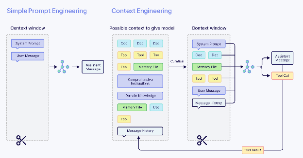
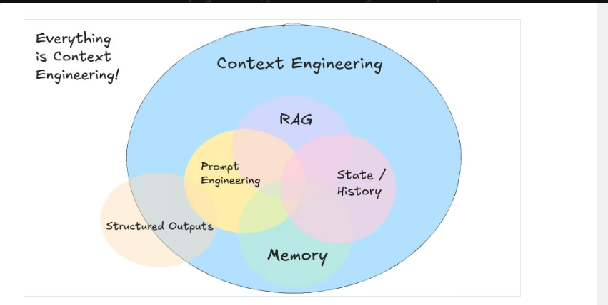
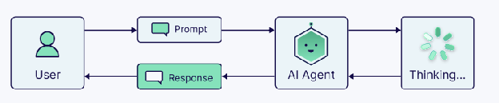
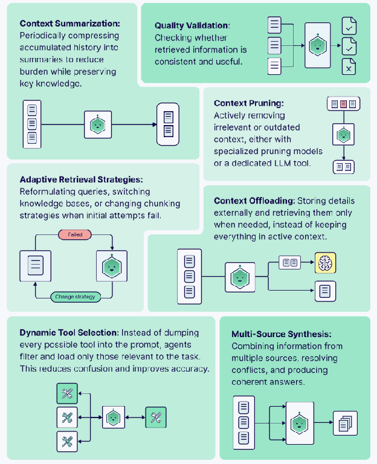

# Context Engineering

**Course:** Building LLM Applications  
**Topic:** Context Engineering — Managing What the Model Sees  

---

## Let's Understand the Problem: When Prompts Aren't Enough

**The Challenge:**

* Your agents sometimes forget important information mid-conversation
* Performance degrades as conversations get longer
* Relevant information gets **lost** in long context windows
* Costs increase dramatically with larger prompts

**Traditional Approach (Prompt Engineering):** Focus on crafting the perfect prompt with the right words and instructions.

**The Reality:** Modern AI applications need more than good prompts — they need intelligent information management. That is **Context Engineering**.



**Context Engineering** is the discipline of designing the architecture that feeds an LLM the right information at the right time. It's not about changing the model itself, but about building the bridges that connect it to the outside world — retrieving external data, connecting it to live tools, and giving it a memory to ground its responses in facts, not just its training data.

<MultiLineNote>
**Compact definition** 🎉

Context engineering is the art and science of filling the LLM's context window with just the right information, in the right format, at the right time to accomplish a task.
</MultiLineNote>

---

## Key Differences: Context Engineering vs Prompt Engineering

| Feature | Prompt Engineering | Context Engineering |
|---------|-------------------|---------------------|
| Focus | Input phrasing | System-level design |
| Scope | One-time interaction | Multi-turn interaction |
| Flexibility | Static | Dynamic |
| Techniques | Text prompts, few-shot examples | Tool integration, memory, orchestration |
| Use Cases | Text generation, Q&A | Enterprise workflows, copilots, agents |
| ROI | High initial effort | Higher long-term scalability |

While prompt engineering is excellent for prototyping or consumer-facing apps, context engineering is essential for **enterprise-grade AI** that needs to scale across departments, use cases, and data sources.

### Performance Comparison: Context Engineering vs Prompt Engineering

| Metric | Prompt Engineering | Context Engineering |
|--------|-------------------|---------------------|
| Session Recall | Low | High |
| Personalization | Manual | Automated |
| Error Reduction | Moderate | High |
| Tool Access | Limited | Seamless |



Think of the LLM as a CPU and the context window as RAM. Just like a computer needs the right data loaded in RAM to run programs well, your AI needs the right context to perform tasks effectively.

---

## The Context Engineering Process

Context engineering is the systems-level discipline of designing, constructing, and maintaining the informational environment (context) in which an AI model operates at runtime.

### Agents

As soon as you start building real systems with large language models, you run into the limits of static pipelines. A fixed recipe of "retrieve, then generate" works fine for simple **Retrieval Augmented Generation (RAG)** setups, but it falls apart once the task requires judgment, adaptation, or multi-step reasoning.

This is where **Agents** come in. In the context of context engineering, agents manage how (and how well) information flows through a system. Instead of blindly following a script, agents can evaluate what they know, decide what they still need, select the right tools, and adjust their strategy when things go wrong.



Agents are both the architects of their contexts and the users of those contexts.

The term "**agent**" gets used broadly, so let's define it in the context of building with large language models (LLMs). As the **Building AI Agents with LangChain** session put it, an AI agent is a system that can operate independently to achieve a goal without constant human intervention. Concretely, that means it can:

* **Decide what it still needs to know** — rather than answering from whatever it was handed
* **Choose and call a tool** to go and get it
* **Read the result and decide what to do next** — call another tool, or answer
* **Change strategy when something fails** instead of stopping

Every one of those four steps either **adds** something to the context window or **reads** from it. That is why agents and context engineering are the same subject: an agent is a program whose main job is deciding what goes into its own next prompt.

### Context for AI Agents

Everything an agent "knows" at any moment falls into six buckets. They all compete for the same limited window, which is why naming them matters:

| Type | What it is | Typical size |
|------|-----------|--------------|
| **Instructions** | Role, objective, rules, output format | Small, always present |
| **Examples** | Worked demonstrations of what good looks like | Small, always present |
| **Knowledge** | Domain facts, retrieved documents, task data | Large, varies per turn |
| **Memory** | Short-term conversation state; long-term user facts | Grows over time |
| **Tools** | Descriptions of what the agent can call | Fixed, often underestimated |
| **Tool results** | What came back from those calls | Large and unpredictable |


Two of these surprise people. **Tool descriptions** sit in the window on every turn whether a tool is used or not — twenty registered tools is a permanent tax on every request. And **tool results** are the least predictable of the six: a single search can return more tokens than the entire conversation before it. Remember that second one; it is the culprit in the hands-on section later.

### Strategies and Tasks for Agents

An agent managing its own context has a small repertoire of moves. You do not need all of them today — the four in bold are the ones this session builds:

| Strategy | What the agent does |
|----------|--------------------|
| **Context Summarization** | Compress accumulated history into a summary, keeping the key facts |
| **Context Pruning** | Actively drop context that is no longer needed |
| **Context Offloading** | Store details outside the window and fetch them only when required |
| **Dynamic Tool Selection** | Load only the tools relevant to this task, not every tool it owns |
| Quality Validation | Check whether retrieved information is consistent and useful |
| Adaptive Retrieval | Reformulate the query or switch sources when the first attempt fails |
| Multi-Source Synthesis | Combine several sources, resolving conflicts between them |



---

## The Problems That Appeared Using Prompt Engineering

### 1. Information Overload

In a conversation, when the user asks a question, the process typically unfolds like this:

1. **Turn 1:** The user asks a question (10 tokens).
2. **Turn 2:** The AI searches the web, gathers relevant information (500 tokens).
3. **Turn 3:** The AI performs calculations (200 tokens).
4. **Turn 4:** The user follows up with another question (20 tokens).
5. **Turn 5:** The AI conducts another web search (500 tokens).

This continues, and over time, as the conversation progresses through multiple turns, the context builds up to a large amount, reaching 50,000 tokens in total. At this point, the AI must manage this extensive context, which is challenging since it has **limited memory**.

### 2. Context Hygiene

This is one of the most critical parts of managing agentic systems. Agents don't just need memory and tools; they also need to monitor and manage the quality of their own context. That means avoiding overload, detecting irrelevant or conflicting information, pruning or compressing as needed, and keeping their in-context memory clean enough to reason effectively.

Here are some common types of errors that begin to happen, or increase, as context window size grows:


You met these four in the **Introduction to Context Engineering** session, along with the fixes. What matters now is the practical half: **how you recognise each one in an agent you are actually running**, and which technique from this session addresses it.

| Failure | What it is | What you actually see | Fix it with |
|---------|-----------|----------------------|-------------|
| **Poisoning** | A wrong fact enters the context and gets reused | The agent states the same wrong thing confidently, turn after turn, and re-asserts it even when corrected | Validate before writing. Never persist a fact the agent only inferred |
| **Distraction** | Too much history crowds out fresh reasoning | It repeats an action it already did, or re-runs a search it already ran | **Compaction** — and prune old tool output first |
| **Confusion** | Irrelevant tools or documents mislead it | It calls the wrong tool, or picks a tool that does not fit the question | Cut the tool list for the task. Sharpen tool descriptions (Principle 3) |
| **Clash** | Two pieces of context contradict each other | It stalls, hedges, or flips between two answers across turns | Resolve on write — update the old fact, do not append a second one |

Two of these are worth separating, because they look identical from the outside and have opposite fixes. **Distraction is too much context; confusion is the wrong context.** If the agent is repeating itself, you have too much history — compact. If it is reaching for the wrong tool, you have too many tools — narrow the list. Compacting a confused agent does nothing, and trimming tools from a distracted one does nothing either.

### 3. Just Prompts Aren't Enough

**Context Accumulates:** As the conversation continues, the context expands, including the original prompt, tool descriptions, past responses, external data, and any examples shared.

**Memory Limitations:** AI has limited memory, and it can only handle so much information. Too much irrelevant or outdated context can negatively affect performance.

**Focus on Relevance:** Effective context management involves prioritizing relevant information and filtering out what's unnecessary to maintain clarity.

**Prompt Writing is Just One Piece:** While a clear prompt helps, the AI's performance also depends on keeping the context organized and focused. Too much clutter can disrupt its ability to respond accurately.

---

## The Solution: How to Leverage Context Engineering

### Principle 1: Minimal High-Quality Information

**Goal:** Extract the minimum amount of high-quality information needed to complete the task.

**Think of it like packing a suitcase:**

* Avoid packing your entire wardrobe.
* Pack only the essentials you'll actually use.
* Choose versatile items that can work in various situations.

**Applied to AI:**

* Don't include entire documents — highlight the key points.
* Don't keep every old message — focus on summarizing the important ones.
* Don't provide 20 examples — offer 3–5 diverse and clear ones.

### Principle 2: Smart System Prompts

You already know how to write a good prompt — the **Effective Prompting Techniques** session covered clarity, specificity, contextual awareness, output guidance and reusable templates. Those all still apply.

What changes in an agent is that the system prompt is not written once and read once. It is **re-sent on every single turn**, and that has two consequences worth designing around:

* **Its tokens compound.** A 500-token system prompt across a 40-turn conversation is 20,000 tokens you paid for repeatedly. Tighten it once and you save on every turn, forever.
* **Its instructions compete.** Every rule you add makes every other rule slightly less salient. A system prompt with thirty rules is followed less reliably than one with six.

So the goal is not the most complete system prompt. It is the smallest one that still produces the behaviour you need.

Two techniques are worth knowing because they work by *shaping the context* rather than rewording the instruction:


* **Chain of Thought** — ask the model to reason in steps before answering. Useful exactly when retrieved documents are dense or contradict each other, because the reasoning becomes visible and checkable.
* **Few-Shot Prompting** — put a few worked examples in the window to demonstrate the format and style you want. This is Principle 1 in action: three to five well-chosen examples beat twenty mediocre ones, and they cost fewer tokens.

**Tips for an agent's system prompt**

* **Put the rules that must never be broken at the top.** Instructions in the middle of a long context get the least attention.
* **Say what to do, not only what to avoid.** "Answer in one paragraph" beats "don't be verbose".
* **Cut anything the tools already say.** If a tool description explains when to use it, repeating that in the system prompt is paying twice.
* **Re-read it once a week.** System prompts accumulate rules added to fix one-off failures, and those rules never get removed.

### Principle 3: Efficient Tool Design

**Tools** are actions that AI can perform (e.g., searching the web, running code, querying a database, etc.).

**Good tools:**

* Have one clear, specific purpose.
* Return focused, relevant information (not data dumps).
* Have descriptive names (e.g., `get_current_weather` rather than `tool_1`).
* Don't overlap with other tools.

**Bad tool design:**

* Tool 1: `search_documents` (searches all documents)
* Tool 2: `find_files` (also searches documents)
* Tool 3: `query_database` (can also search documents)

This causes confusion for the AI about which tool to use!

**Good tool design:**

* Tool 1: `search_document_by_keyword` (full-text search)
* Tool 2: `get_document_by_id` (retrieve a specific known document)
* Tool 3: `list_recent_documents` (browse recent items)

Each tool has a clear, distinct purpose.

### Principle 4: Smart Information Retrieval — *select*

**Traditional Approach: Pre-loading All Data**

1. User asks a question.
2. Search all databases, documents, and files at once.
3. Load everything into the system's context.
4. AI processes all available information.

**Problem:** This approach can load large volumes of irrelevant data, occupying valuable context space and slowing down the process.

**Modern Approach: "Just in Time" Data Retrieval**

1. User asks a question.
2. AI determines the specific information required.
3. AI uses relevant tools to retrieve only the necessary data.
4. AI processes the focused, relevant data.
5. If more information is needed, the process repeats from step 2.

**Example:**

> User: "What were our sales in Q3 2024 for Product X?"

**Old Method:**

* Load all sales data from 2024 (e.g., 10,000 rows).
* AI sifts through all of it, wasting context space.

**New Method:**

* AI identifies the need for Q3 2024 data for Product X.
* Tool runs a query:

  ```sql
  SELECT * FROM sales WHERE quarter='Q3' AND year=2024 AND product='X'
  ```

* Only 50 relevant rows are returned and processed by AI.

---

## Advanced Techniques for Long Tasks

When tasks are so lengthy they exceed even optimized context.

### First, the Names

The **Introduction to Context Engineering** session gave you four techniques: **write, select, compress, isolate**. This session works through the same four in practice, so it is worth pinning the vocabulary down before we start — the practical names and the conceptual ones are the same ideas:

| Technique (Session 41) | In practice | Where in this session |
|------------------------|-------------|----------------------|
| **Write** context | Note-taking to a file outside the window | Technique 2, below |
| **Select** context | Just-in-time retrieval — fetch only what the question needs | Principle 4, above |
| **Compress** context | Compaction — summarise the old, keep the recent | Technique 1, below, and the hands-on |
| **Isolate** context | Sub-agents — give each a small, focused window | Technique 3, below |

If you only remember one thing from the mapping: **select** decides what comes *in*, and **write**, **compress** and **isolate** all decide what goes *out* — to a file, to a summary, or to another agent.

### Technique 1: Compaction — *compress*

**When to use:** When the task is ongoing, and the context is nearing its limit.

**How it works:**

1. When the context reaches about 80% of its capacity, the AI creates a summary of the entire conversation.
2. The system then continues with just the summary and the most recent messages.
3. This allows the AI to reset, focusing on the essential details while maintaining continuity.

**Example:**

**Original (5,000 tokens):**

* User asked to debug code.
* AI found 3 bugs in `database.py`.
  * Fixed bug #1: missing null check.
  * Fixed bug #2: incorrect query.
* User inquired about performance.
* AI profiled code, identified a slow function.
  * Optimized performance using caching.
* Many additional steps followed.

**After Compaction (500 tokens):**

> **Summary:** Debugging session for `database.py`
>
> * Fixed 3 bugs (null check, query syntax, indexing).
> * Optimized performance with caching.
> * Current status: All tests passing.
> * Next: User wants to add a new feature.

Now, the AI works with this compact summary, allowing the task to continue efficiently without losing track of key information.

### Technique 2: Note-Taking — *write*

**When to use:** When the AI needs to remember details across multiple context resets.

**How it works:**

* The AI keeps a separate note file outside of the current context window. For example, it might create a file like `NOTES.md` to store important details.
* This file contains:
  * **Completed tasks**
  * **In-progress items**
  * **Technical decisions**
  * **Known issues**
* When the context resets, the AI refers to its notes and continues from where it left off.

**Example of `NOTES.md`:**

```markdown
Project: E-commerce website

Completed:
- Set up database schema
- Built user authentication
- Created product catalog

In Progress:
- Shopping cart feature (70% done)
- Need to add: discount code logic

Technical Decisions:
- Using PostgreSQL for the main database
- Redis for session storage
- Payment via Stripe API

Known Issues:
- Image upload slow (needs optimization)
```

When the context resets, the AI can read the notes and continue working from where it left off.

**Real example:** For a game like *Pokémon*, an AI can keep notes on:

* Pokémon levels
* Explored areas
* Battle strategies

After a context reset, the AI reads its notes and picks up from where it left off, continuing training or exploration.

### Technique 3: Sub-agents — *isolate*

**When to use:** For complex tasks with distinct parts.

**How it works:**

* **Main AI (Coordinator):** Handles the overall task and delegates work to specialized sub-agents.
* **Sub-agent 1: Web Research**
  * Searches competitor websites
  * Reads 20 articles
  * Returns a 2-paragraph summary
* **Sub-agent 2: Data Analysis**
  * Queries internal database
  * Runs statistical analysis
  * Returns key findings in bullet points

The main AI receives both summaries (with a small token count) and synthesizes the final recommendation.

**Benefits:**

* Sub-agents can process large amounts of data (using thousands of tokens for deep work).
* The main AI only sees concise results, keeping the context clean and focused.

---

## Hands-On: Pruning and Compaction on Your Own Agent

Time to do this to an agent you already have. The two techniques that pay off first are **tool-output pruning** and **compaction**, and LangChain ships both as middleware — you add them to `create_agent` without touching your tools.

### The Culprit: Retrieved Chunks

Look at where the tokens actually go. A retrieval tool returns three chunks per call; three calls into a conversation, that history is almost entirely tool output:

```python
from langchain_core.messages import HumanMessage, AIMessage, ToolMessage
from langchain_core.messages.utils import count_tokens_approximately

big = "Retrieved chunk. " * 200          # one tool result

messages = [HumanMessage("start")]
for i in range(3):
    messages.append(AIMessage(content="", tool_calls=[
        {"name": "search_docs", "args": {"query": f"q{i}"}, "id": f"c{i}"}]))
    messages.append(ToolMessage(content=big, tool_call_id=f"c{i}"))

print(count_tokens_approximately(messages))
```

```
2649
```

Your actual question was four words. Everything else is chunks you already used.

### Technique: Tool-Output Pruning

Old tool results are the easiest thing to throw away, because the model has already read them and written its answer. `ClearToolUsesEdit` replaces them with a placeholder, keeping the most recent few intact:

```python
from langchain.agents.middleware import ClearToolUsesEdit

edit = ClearToolUsesEdit(trigger=500, keep=1, placeholder="[cleared]")
edit.apply(messages, count_tokens=count_tokens_approximately)

print(count_tokens_approximately(messages))
```

```
953
```

**2,649 → 953 tokens. A 64% reduction, and nothing the model still needed was lost.** Look at what happened to each tool result:

```
msg[2] ToolMessage -> '[cleared]'
msg[4] ToolMessage -> '[cleared]'
msg[6] ToolMessage -> 'Retrieved chunk. Retrieved chunk. Retrieved chunk...'
```

The two older ones are gone; `keep=1` preserved the newest. Three settings do the work:

| Setting | What it does |
|---------|--------------|
| `trigger` | Token count above which pruning kicks in. Below it, nothing happens. |
| `keep` | How many recent tool results to leave untouched |
| `exclude_tools` | Tools whose output must never be cleared |

### Wiring It Into the Agent

In a real agent you do not call `.apply()` yourself — you hand the edit to middleware and it runs before every model call:

```python
from langchain.agents import create_agent
from langchain.agents.middleware import (
    ContextEditingMiddleware, ClearToolUsesEdit, SummarizationMiddleware,
)

agent = create_agent(
    model=model,
    tools=[search_docs],
    middleware=[
        # 1. throw away old tool output
        ContextEditingMiddleware(
            edits=[ClearToolUsesEdit(trigger=4000, keep=2)],
        ),
        # 2. if it is STILL too long, summarise the older messages
        SummarizationMiddleware(
            model=model,
            trigger=("fraction", 0.8),
            keep=("messages", 10),
        ),
    ],
)
```

<MultiLineNote>
Remember the "about 80%" threshold from the compaction section? That is this, literally: `trigger=("fraction", 0.8)` means *summarise once the context is 80% full*. You can also trigger on an absolute count with `("tokens", 50000)` or on message count with `("messages", 40)`.

`keep=("messages", 10)` is the other half — how much recent conversation survives the summary untouched.
</MultiLineNote>

### Why This Order

Pruning first, compaction second. Both shrink the context, but they cost differently:

* **Pruning is free.** It deletes text. No model call, no latency.
* **Compaction costs a model call.** It has to read the history and write a summary.

So throw away the cheap stuff first, and only pay for a summary if you are still over budget after that. Reversed, you would pay a model to summarise chunks you were about to delete anyway.

<MultiLineWarning text="Pruning changes what is sent, not what is stored">

The middleware edits the messages on their way **to the model**. Your saved conversation still holds the full tool results.

That is the behaviour you want — the data is not lost, you simply stop paying to re-send it every turn — but it means you cannot check that pruning worked by printing your stored history. Count the tokens going into the model call instead.

</MultiLineWarning>

### Try It Yourself

1. Change `keep=1` to `keep=2` and re-run the pruning example. How many tokens now, and why?
2. Set `trigger=100000` instead of `500`. What happens, and what does that tell you about when pruning fires?
3. Add `exclude_tools=["search_docs"]`. Predict the result before you run it.

---

## Choosing the Right Approach

| Task length | Approach | What it looks like |
|-------------|----------|--------------------|
| **Simple (< 5 minutes)** | Effective **prompt engineering** | Clear instructions · a few examples · specify output format |
| **Medium (5–30 minutes)** | **Context engineering basics** | Well-designed tools · just-in-time retrieval (*select*) · tight prompts |
| **Long conversations (30+ minutes)** | **Compaction** (*compress*) | Summarize when context fills up · keep the last few messages + summary |
| **Multi-session projects (hours/days)** | **Note-taking** (*write*) | Persistent memory file · AI reads and updates the notes across resets |
| **Complex multi-part tasks** | **Sub-agents** (*isolate*) | Break the work into specialized pieces · main AI synthesizes results |

One technique is missing from that table on purpose: **tool-output pruning**. It is not a choice you make per task — it is close to free, so once your agent calls tools at all, leave it on.

---

## Key Takeaways

**1. The Evolution**

* **Prompt Engineering:** Writing good instructions.
* **Problem:** AI needs more than just instructions.
* **Context Engineering:** Strategically managing all information.

**2. Core Principles**

* Context is a **limited resource**.
* Goal: Provide the **minimum information** for maximum effectiveness.
* Think holistically: integrate prompts, tools, data, and history.

**3. As AI improves**

Less hand-holding will be required, making **context engineering** even more crucial.

---

## Final Thoughts

> *Context engineering is about being smart with AI's "working memory" — providing just enough of the right information, at the right time, in the right format to excel at complex, multi-step tasks.*
