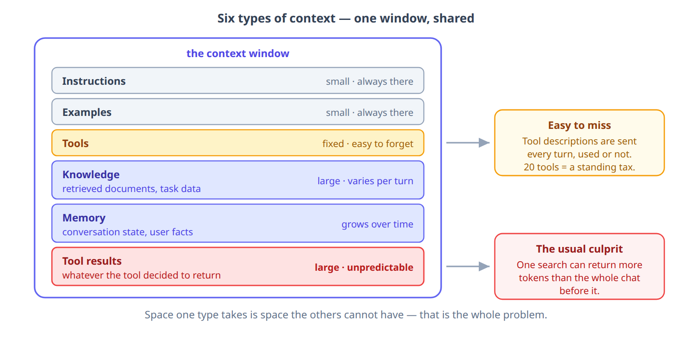
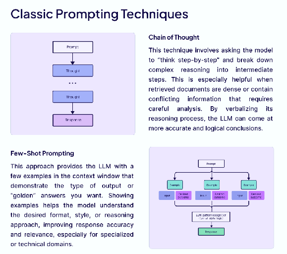

# Context Engineering

**Course:** Building LLM Applications  
**Topic:** Context Engineering — Managing What the Model Sees  

---

## The Problem: Our Agent Gets Worse the Longer You Talk to It

In the **Building AI Agents with LangChain** session we built the SkillMap Agent. It searches for jobs, researches skill demand, and remembers the learner across sessions. Five turns in, it is doing all of that well.

But watch what happens over a longer conversation. The learner asks three questions in a row, each triggering a Tavily search and a JSearch call:

* **Turn 1:** "What's the demand for Generative AI?" → Agent searches, returns a summary with salary data.
* **Turn 3:** "Find me GenAI jobs in Hyderabad." → Agent searches, returns 5 job listings.
* **Turn 5:** "Now show me AI Engineer roles in Bangalore." → Agent searches, returns 5 more listings.

By turn 5, every previous search result — hundreds of tokens of salary data, job titles, company names, apply links — is still sitting in the context window. The agent re-sends all of it to the model on every single turn, even though the learner has moved on.

* **Turn 7:** "Which of the Bangalore roles need less than 2 years experience?"

The agent re-runs the search instead of reading the results it already has. Or it answers from the Hyderabad results, not the Bangalore ones. Or it starts ignoring the system prompt's formatting rules.

Nothing is broken. The agent is doing exactly what it did on turn 1 — but the context window is now full of stale tool output, and the model is drowning in it.

> The agent did not get dumber. Its context got noisier.

### What Is Actually Happening

In the **Introduction to Context Engineering** session, we named this problem and its cousins:

| Failure | What the student just saw |
|---------|--------------------------|
| **Distraction** | The agent repeated a search it already ran (turn 7) — too much history crowding out fresh reasoning |
| **Confusion** | It answered from the wrong city's results — irrelevant data misleading the model |

We also named four techniques to fix them: **write, select, compress, isolate**. This session puts those techniques into practice — with real code, on a real agent.

---

## What We Already Know (Quick Recap)

The **Introduction to Context Engineering** session covered the concepts. Here is the vocabulary we need going forward — one line each:

| From Session 41 | One-line reminder |
|-----------------|-------------------|
| **Context Engineering** | The discipline of filling the context window with the right information, in the right format, at the right time |
| **Context Poisoning** | A wrong fact enters the context and gets reused — the agent states the same wrong thing confidently |
| **Context Distraction** | Too much history crowds out fresh reasoning — the agent repeats actions it already took |
| **Context Confusion** | Irrelevant tools or documents mislead the model — it calls the wrong tool |
| **Context Clash** | Contradictory information — the agent stalls or flips between answers |
| **Write** | Save information outside the window for later |
| **Select** | Fetch only what the current question needs |
| **Compress** | Summarize the old, keep the recent |
| **Isolate** | Give each sub-agent a small, focused window |

If any of these are unfamiliar, revisit that session before continuing. This session assumes them.

---

## Context for AI Agents

Everything an agent "knows" at any moment falls into six buckets. They all compete for the same limited window, which is why naming them matters:

| Type | What it is | Typical size |
|------|-----------|--------------|
| **Instructions** | Role, objective, rules, output format | Small, always present |
| **Examples** | Worked demonstrations of what good looks like | Small, always present |
| **Knowledge** | Domain facts, retrieved documents, task data | Large, varies per turn |
| **Memory** | Short-term conversation state; long-term user facts | Grows over time |
| **Tools** | Descriptions of what the agent can call | Fixed, often underestimated |
| **Tool results** | What came back from those calls | Large and unpredictable |



Two of these surprise people. **Tool descriptions** sit in the window on every turn whether a tool is used or not — twenty registered tools is a permanent tax on every request. And **tool results** are the least predictable of the six: a single search can return more tokens than the entire conversation before it.

That second one is exactly what happened in our opening scenario. The SkillMap Agent's Tavily and JSearch results are tool output — and three rounds of them buried everything else.

---

## Four Principles for Managing Context

These are the design rules. The hands-on section that follows puts them into code.

### Principle 1: Minimal High-Quality Information

**Goal:** Extract the minimum amount of high-quality information needed to complete the task.

**Think of it like packing a suitcase:**

* Avoid packing your entire wardrobe.
* Pack only the essentials you'll actually use.
* Choose versatile items that can work in various situations.

**Applied to AI:**

* Don't include entire documents — highlight the key points.
* Don't keep every old message — focus on summarizing the important ones.
* Don't provide 20 examples — offer 3–5 diverse and clear ones.

### Principle 2: Smart System Prompts

You already know how to write a good prompt — the **Effective Prompting Techniques** session covered clarity, specificity, contextual awareness, output guidance and reusable templates. Those all still apply.

What changes in an agent is that the system prompt is not written once and read once. It is **re-sent on every single turn**, and that has two consequences worth designing around:

* **Its tokens compound.** A 500-token system prompt across a 40-turn conversation is 20,000 tokens you paid for repeatedly. Tighten it once and you save on every turn, forever.
* **Its instructions compete.** Every rule you add makes every other rule slightly less salient. A system prompt with thirty rules is followed less reliably than one with six.

So the goal is not the most complete system prompt. It is the smallest one that still produces the behaviour you need.

Two techniques are worth knowing because they work by *shaping the context* rather than rewording the instruction:



* **Chain of Thought** — ask the model to reason in steps before answering. Useful exactly when retrieved documents are dense or contradict each other, because the reasoning becomes visible and checkable.
* **Few-Shot Prompting** — put a few worked examples in the window to demonstrate the format and style you want. This is Principle 1 in action: three to five well-chosen examples beat twenty mediocre ones, and they cost fewer tokens.

**Tips for an agent's system prompt**

* **Put the rules that must never be broken at the top.** Instructions in the middle of a long context get the least attention.
* **Say what to do, not only what to avoid.** "Answer in one paragraph" beats "don't be verbose".
* **Cut anything the tools already say.** If a tool description explains when to use it, repeating that in the system prompt is paying twice.
* **Re-read it once a week.** System prompts accumulate rules added to fix one-off failures, and those rules never get removed.

### Principle 3: Efficient Tool Design

**Tools** are actions that AI can perform (e.g., searching the web, running code, querying a database, etc.).

**Good tools:**

* Have one clear, specific purpose.
* Return focused, relevant information (not data dumps).
* Have descriptive names (e.g., `get_current_weather` rather than `tool_1`).
* Don't overlap with other tools.

**Bad tool design:**

* Tool 1: `search_documents` (searches all documents)
* Tool 2: `find_files` (also searches documents)
* Tool 3: `query_database` (can also search documents)

This causes confusion for the AI about which tool to use!

**Good tool design:**

* Tool 1: `search_document_by_keyword` (full-text search)
* Tool 2: `get_document_by_id` (retrieve a specific known document)
* Tool 3: `list_recent_documents` (browse recent items)

Each tool has a clear, distinct purpose.

### Principle 4: Smart Information Retrieval — *select*

**Traditional Approach: Pre-loading All Data**

1. User asks a question.
2. Search all databases, documents, and files at once.
3. Load everything into the system's context.
4. AI processes all available information.

**Problem:** This approach can load large volumes of irrelevant data, occupying valuable context space and slowing down the process.

**Modern Approach: "Just in Time" Data Retrieval**

1. User asks a question.
2. AI determines the specific information required.
3. AI uses relevant tools to retrieve only the necessary data.
4. AI processes the focused, relevant data.
5. If more information is needed, the process repeats from step 2.

**Example:**

> User: "What were our sales in Q3 2024 for Product X?"

**Old Method:**

* Load all sales data from 2024 (e.g., 10,000 rows).
* AI sifts through all of it, wasting context space.

**New Method:**

* AI identifies the need for Q3 2024 data for Product X.
* Tool runs a query:

  ```sql
  SELECT * FROM sales WHERE quarter='Q3' AND year=2024 AND product='X'
  ```

* Only 50 relevant rows are returned and processed by AI.

---

## Hands-On: Pruning and Compaction on Your Own Agent

Time to do this to an agent you already have. The two techniques that pay off first are **tool-output pruning** and **compaction**, and LangChain ships both as middleware — you add them to `create_agent` without touching your tools.

### The Culprit: Retrieved Chunks

Look at where the tokens actually go. This is the same problem from our opening — a retrieval tool returns chunks per call, and three calls into a conversation, that history is almost entirely tool output:

```python
from langchain_core.messages import HumanMessage, AIMessage, ToolMessage
from langchain_core.messages.utils import count_tokens_approximately

big = "Retrieved chunk. " * 200          # one tool result

messages = [HumanMessage("start")]
for i in range(3):
    messages.append(AIMessage(content="", tool_calls=[
        {"name": "skill_demand", "args": {"query": f"q{i}"}, "id": f"c{i}"}]))
    messages.append(ToolMessage(content=big, tool_call_id=f"c{i}"))

print(count_tokens_approximately(messages))
```

```
2649
```

Your actual question was four words. Everything else is chunks you already used — exactly what buried the SkillMap Agent by turn 7.

### Technique: Tool-Output Pruning

Old tool results are the easiest thing to throw away, because the model has already read them and written its answer. `ClearToolUsesEdit` replaces them with a placeholder, keeping the most recent few intact:

```python
from langchain.agents.middleware import ClearToolUsesEdit

edit = ClearToolUsesEdit(trigger=500, keep=1, placeholder="[cleared]")
edit.apply(messages, count_tokens=count_tokens_approximately)

print(count_tokens_approximately(messages))
```

```
953
```

**2,649 → 953 tokens. A 64% reduction, and nothing the model still needed was lost.** Look at what happened to each tool result:

```
msg[2] ToolMessage -> '[cleared]'
msg[4] ToolMessage -> '[cleared]'
msg[6] ToolMessage -> 'Retrieved chunk. Retrieved chunk. Retrieved chunk...'
```

The two older ones are gone; `keep=1` preserved the newest. Three settings do the work:

| Setting | What it does |
|---------|--------------|
| `trigger` | Token count above which pruning kicks in. Below it, nothing happens. |
| `keep` | How many recent tool results to leave untouched |
| `exclude_tools` | Tools whose output must never be cleared |

### Wiring It Into the Agent

In a real agent you do not call `.apply()` yourself — you hand the edit to middleware and it runs before every model call:

```python
from langchain.agents import create_agent
from langchain.agents.middleware import (
    ContextEditingMiddleware, ClearToolUsesEdit, SummarizationMiddleware,
)

agent = create_agent(
    model=model,
    tools=[skill_demand_tool, search_jobs],
    middleware=[
        # 1. throw away old tool output
        ContextEditingMiddleware(
            edits=[ClearToolUsesEdit(trigger=4000, keep=2)],
        ),
        # 2. if it is STILL too long, summarise the older messages
        SummarizationMiddleware(
            model=model,
            trigger=("fraction", 0.8),
            keep=("messages", 10),
        ),
    ],
)
```

<MultiLineNote>
Remember the "about 80%" threshold from the compaction section? That is this, literally: `trigger=("fraction", 0.8)` means *summarise once the context is 80% full*. You can also trigger on an absolute count with `("tokens", 50000)` or on message count with `("messages", 40)`.

`keep=("messages", 10)` is the other half — how much recent conversation survives the summary untouched.
</MultiLineNote>

### Why This Order

Pruning first, compaction second. Both shrink the context, but they cost differently:

* **Pruning is free.** It deletes text. No model call, no latency.
* **Compaction costs a model call.** It has to read the history and write a summary.

So throw away the cheap stuff first, and only pay for a summary if you are still over budget after that. Reversed, you would pay a model to summarise chunks you were about to delete anyway.

<MultiLineWarning text="Pruning changes what is sent, not what is stored">

The middleware edits the messages on their way **to the model**. Your saved conversation still holds the full tool results.

That is the behaviour you want — the data is not lost, you simply stop paying to re-send it every turn — but it means you cannot check that pruning worked by printing your stored history. Count the tokens going into the model call instead.

</MultiLineWarning>

### The Proof: Turn 7 Works Now

Go back to the scenario we opened with. The SkillMap Agent with middleware wired in:

* **Turns 1–5:** The same three searches. But now, after each model response, the middleware prunes the older tool results.
* **Turn 7:** "Which of the Bangalore roles need less than 2 years experience?"

The Hyderabad results are gone — pruned after the agent moved on. The Bangalore results are intact — `keep=2` preserved them. The system prompt's formatting rules are no longer buried under 2,000 tokens of stale job listings.

The agent answers from the right data, in the right format. Same agent, same tools, same model. The only change is what it sees.

### Try It Yourself

1. Change `keep=1` to `keep=2` and re-run the pruning example. How many tokens now, and why?
2. Set `trigger=100000` instead of `500`. What happens, and what does that tell you about when pruning fires?
3. Add `exclude_tools=["skill_demand"]`. Predict the result before you run it.

---

## The Four Techniques in Practice

The **Introduction to Context Engineering** session gave you four techniques: **write, select, compress, isolate**. We just used two of them in code (select and compress). Here is how all four map to what you now know:

| Technique | In practice | Where we used it |
|-----------|-------------|------------------|
| **Select** | Just-in-time retrieval — fetch only what the question needs | Principle 4 (above) |
| **Compress** | Compaction — summarise the old, keep the recent | `SummarizationMiddleware` (above) |
| **Write** | Note-taking to a file outside the window | Below |
| **Isolate** | Sub-agents — give each a small, focused window | Below |

If you only remember one thing from the mapping: **select** decides what comes *in*, and **write**, **compress** and **isolate** all decide what goes *out* — to a file, to a summary, or to another agent.

### Note-Taking — *write*

**When to use:** When the AI needs to remember details across multiple context resets.

The AI keeps a separate note file outside of the current context window — for example, `NOTES.md` — containing completed tasks, in-progress items, technical decisions and known issues. When the context resets, the AI reads its notes and continues from where it left off.

```markdown
Project: E-commerce website

Completed:
- Set up database schema
- Built user authentication
- Created product catalog

In Progress:
- Shopping cart feature (70% done)
- Need to add: discount code logic

Technical Decisions:
- Using PostgreSQL for the main database
- Redis for session storage
- Payment via Stripe API

Known Issues:
- Image upload slow (needs optimization)
```

This is exactly what the **Building Memory Agents - Long Term Memory** session built with `InMemoryStore` — the store is the agent's note file, and `save_learner_profile` is the note-taking tool.

### Sub-agents — *isolate*

**When to use:** For complex tasks with distinct parts.

* **Main AI (Coordinator):** Handles the overall task and delegates work to specialized sub-agents.
* **Sub-agent 1: Web Research** — Searches competitor websites, reads 20 articles, returns a 2-paragraph summary.
* **Sub-agent 2: Data Analysis** — Queries internal database, runs statistical analysis, returns key findings in bullet points.

The main AI receives both summaries (with a small token count) and synthesizes the final recommendation. Sub-agents can process large amounts of data; the main AI only sees concise results, keeping the context clean and focused.

---

## Choosing the Right Approach

| Task length | Approach | What it looks like |
|-------------|----------|--------------------|
| **Simple (< 5 minutes)** | Effective **prompt engineering** | Clear instructions · a few examples · specify output format |
| **Medium (5–30 minutes)** | **Context engineering basics** | Well-designed tools · just-in-time retrieval (*select*) · tight prompts |
| **Long conversations (30+ minutes)** | **Compaction** (*compress*) | Summarize when context fills up · keep the last few messages + summary |
| **Multi-session projects (hours/days)** | **Note-taking** (*write*) | Persistent memory file · AI reads and updates the notes across resets |
| **Complex multi-part tasks** | **Sub-agents** (*isolate*) | Break the work into specialized pieces · main AI synthesizes results |

One technique is missing from that table on purpose: **tool-output pruning**. It is not a choice you make per task — it is close to free, so once your agent calls tools at all, leave it on.

---

## Key Takeaways

* **Context is a limited resource.** Six types compete for the same window. Tool results are the most dangerous because they are large and unpredictable.
* **Four principles** guide what goes in: minimal information, tight system prompts, clean tool design, just-in-time retrieval.
* **Four techniques** handle what goes out: write, select, compress, isolate. Pruning is free; compaction costs a model call — do the cheap thing first.
* **The agent did not get dumber. Its context got noisier.** That is the sentence worth carrying out of this session.

---

## Final Thoughts

> *Context engineering is about being smart with AI's "working memory" — providing just enough of the right information, at the right time, in the right format to excel at complex, multi-step tasks.*
